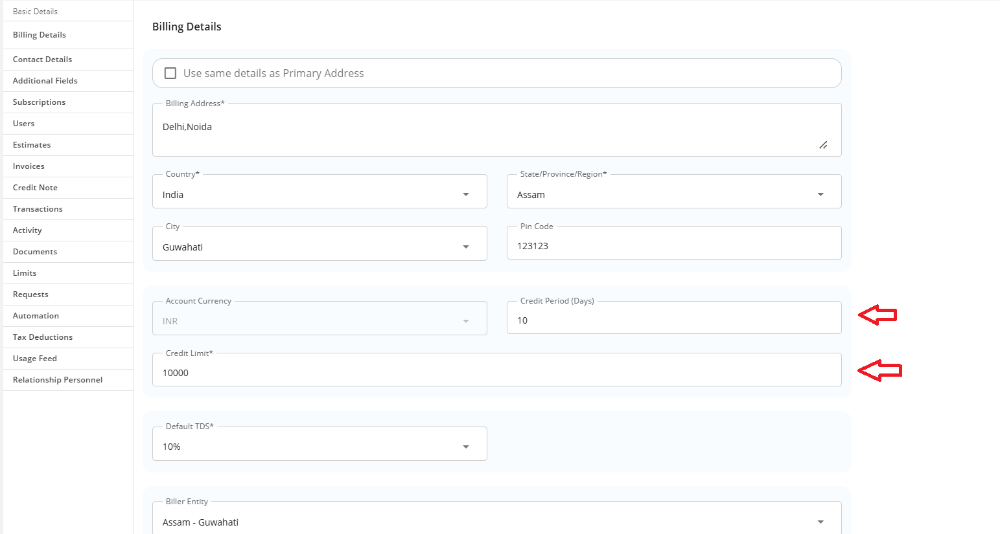
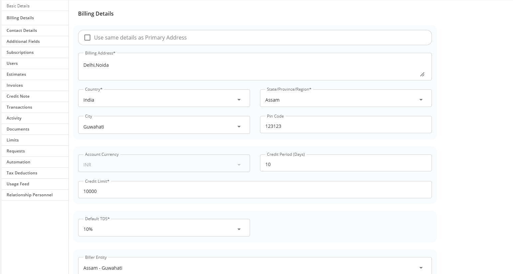

# Updating Credit Limit and Other Billing Information

Subscriber accounts' credit limits and other billing details can be updated from the Apiculus Admin Console.

- To update credit period and credit limit, navigate to account details and update the field under the **Billing Details** sub-section.
	
-  Choose the appropriate **Default TDS** option for the Subscriber account.
	 
- Choose the required **Biller Entity** to map with Subscriber account.
	
 - To update the billing contact, navigate to **Billing Details** and update the field(s) under the **Contact Details** sub-section.
:::note
This article only applies to information update. All billing actions are available under their respective sections.
:::

