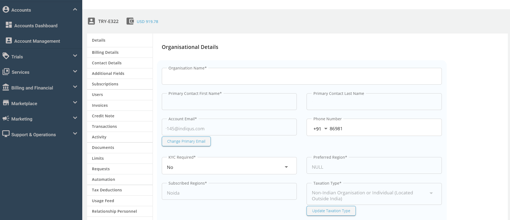
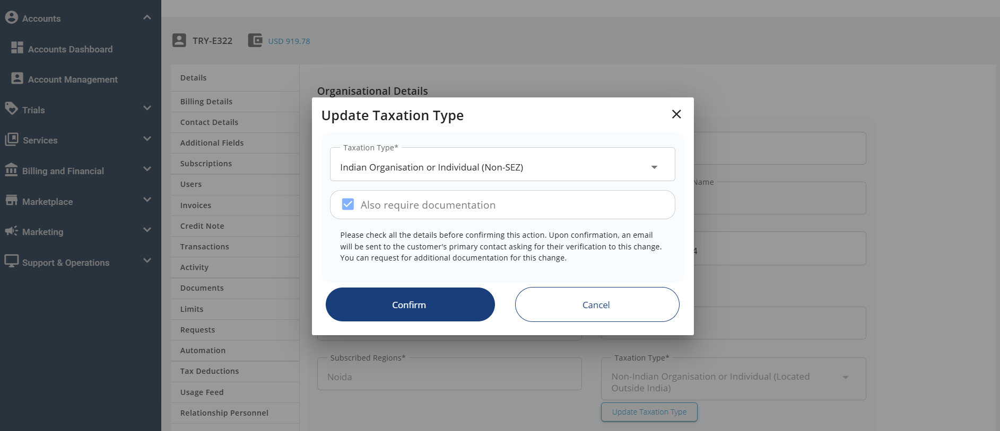
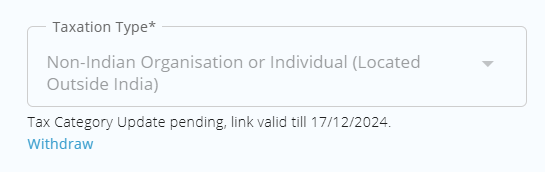

# Updating a Subscriber's Taxation Category

Service provider admins on Apiculus can change customers' taxation categories. This feature is useful for organisations acquiring special tax status, exemption status, or dealing with incorrect classification while creating an account.

The following steps outline this action:

1. Navigate to **Account Management** **_>_** **Details**.
2. Under the **Organisation Details** section, locate the **Taxation Type** field and update the taxation type.
3. Once the **Confirm** button is clicked, a verification email will be sent to the customer, valid for seven days. The **Update** button will then to **Withdraw**. If admins click the **Cancel** button, the action will be canceled.   
   
3. If the admin selects the **Also Require Document** option, the account will go back to being Unverified, which means that the user will now have to upload documents from the **Profile** > **Documents** section.
4. A verification email will be sent to the customer, valid for seven days, the update button will change to withdraw.
5. If the admins click the **Withdraw** button, an email will be sent to the customer.
6. After the customer verifies this by clicking on the **URL** or the **Confirm Tax Update** button in the email they have received, the tax category will be successfully updated.
7. Once the customer verifies the change, a confirmation email should be sent to the admin(s) and the customer.
	:::note
	- The tax category change will be reflected in the current billing cycle.
	- The Tax category can be changed multiple times during a billing cycle by following the same standard process.
	- Any billing generated before the current billing cycle will not be affected and will follow the previously-defined tax category.
	:::

