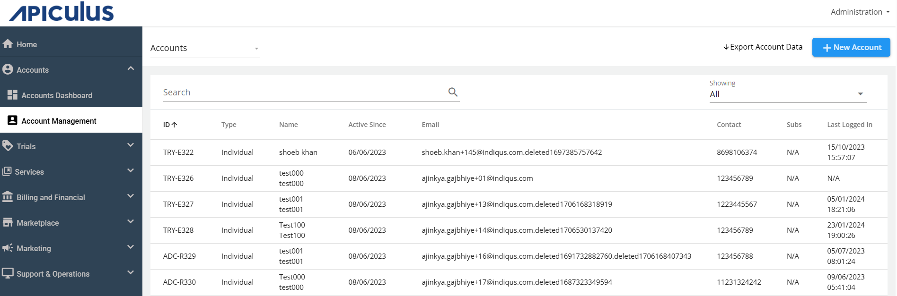
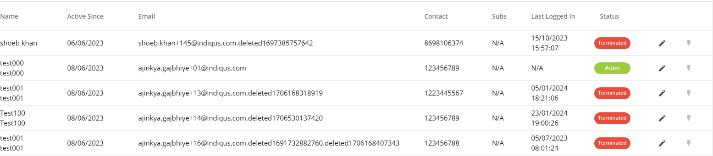
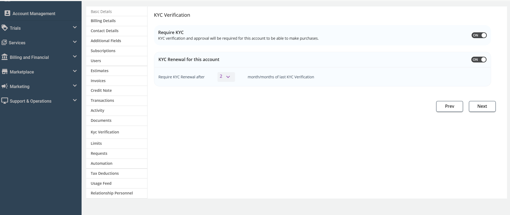
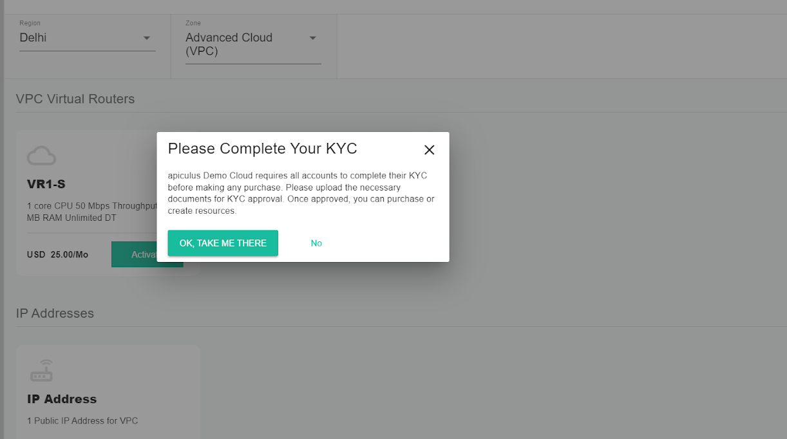
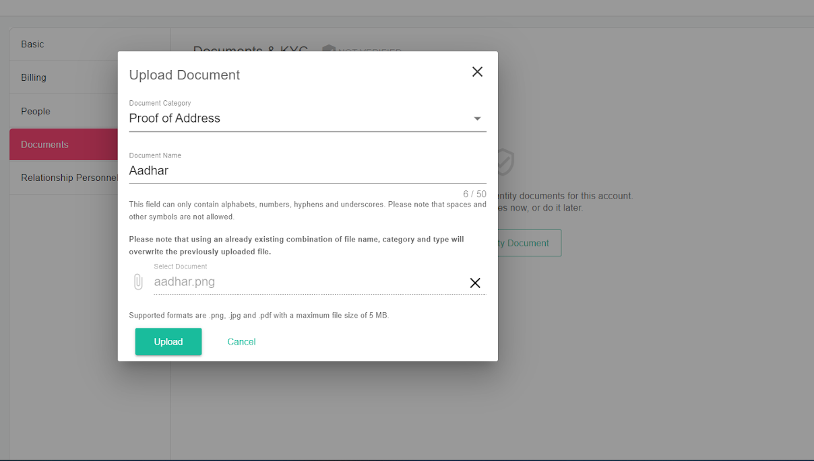
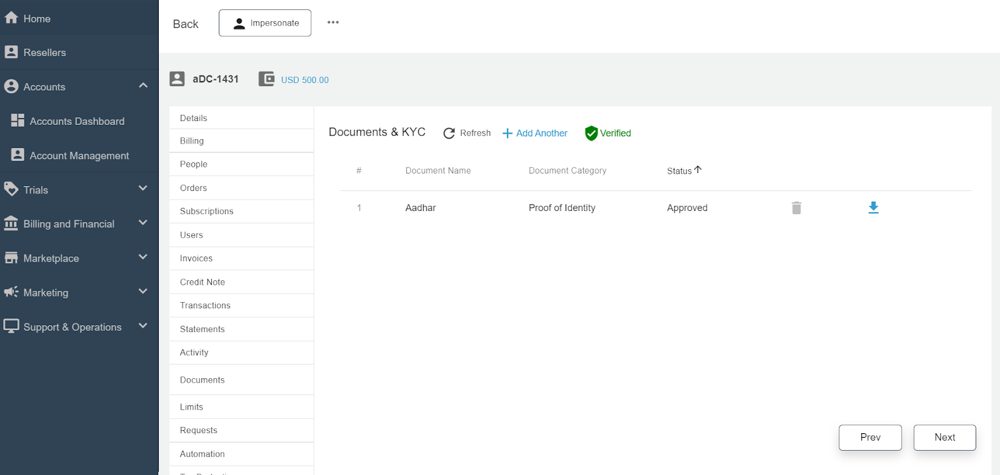
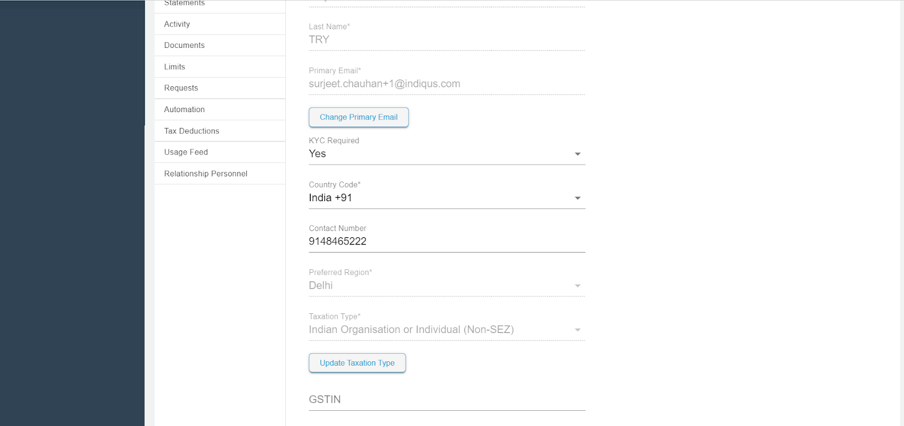

# Working with KYC and Account Verification

The Apiculus Admin Console enables administrators to configure the KYC settings for both organisation and individual user accounts. It also helps them to set the period for KYC renewal for all users and specific accounts as well.

### For All User Accounts

To configure the default KYC settings for all user accounts, navigate to **Administration** > **Settings** > **Account Defaults**. Administrator need to [configure the Account Defaults section](/docs/GettingStarted/SignupConfigurations/ConfiguringAccountDefaults).

### For Specific User Account 

To configure KYC settings for specific user account or admin-assisted account, follow these steps:

1. Navigate to **Accounts > Account Management**. The following screen appears:
	
2. Click the **Edit** icon.
	
	The following screen appears:
	
3. The following KYC verification options are available:
- **Require KYC:** Enable this option to make KYC approval mandatory before purchasing any service from the marketplace.
- **KYC Renewal for this account:** Enable this option to set the number of months after which KYC renewal will be required.

## Actions Required for Self-Signup Accounts/Admin Assisted Accounts

Whenever newly created accounts login to the portal, they will see a popup message for KYC, and the restriction will be applied, preventing them from purchasing or activating any resources.

By clicking **OK** or **TAKE ME THERE**, the user will be redirected to the Basic section and automatically navigated to the **Documents** section. The appropriate document category must be selected, and the required should be uploaded for admin approval.

## Approval Of Documents

1. Once the customer/end-user uploads the documents, admins will receive an email notification.
2. Admins must then navigate to the specific **User Account** > **Documents** section under account management.
3. The customer/end-user will receive an email stating whether the document is approved or rejected. If the document is rejected, the reason for rejection will be provided in the email.
4. Once the documents are approved and the account is verified, the end user will receive an email stating that the identity verification process is complete.

Once the account reaches verified status, that is, KYC is now successfully verified, the subscriber/admin-assisted accounts can proceed with the activation/purchase of resources.

:::note
This is a global setting that will be applied to all the accounts globally after the settings have been published. For all accounts, there is a **KYC Required** field available in the account details. This field can be set to **YES** or **NO**, and it applies to individual accounts.
:::

