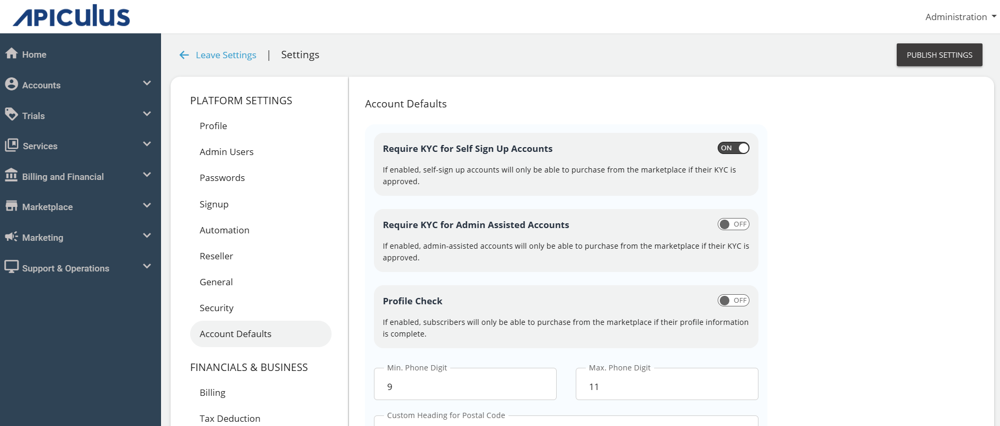
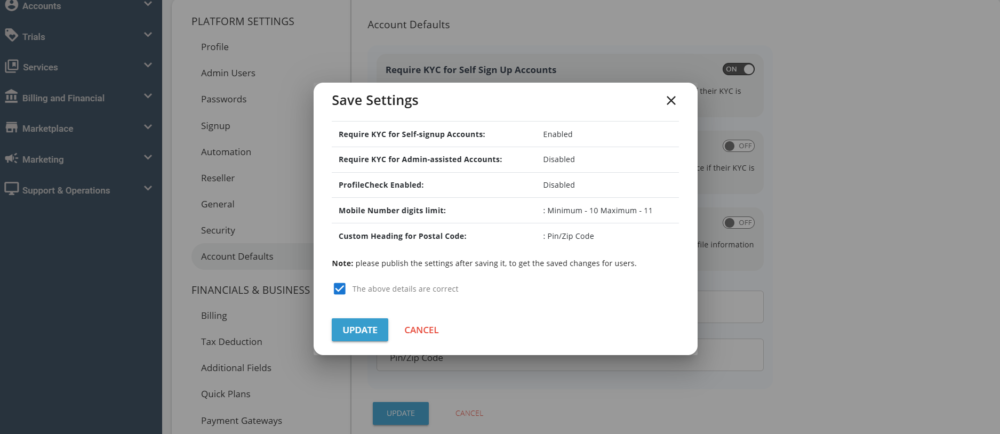
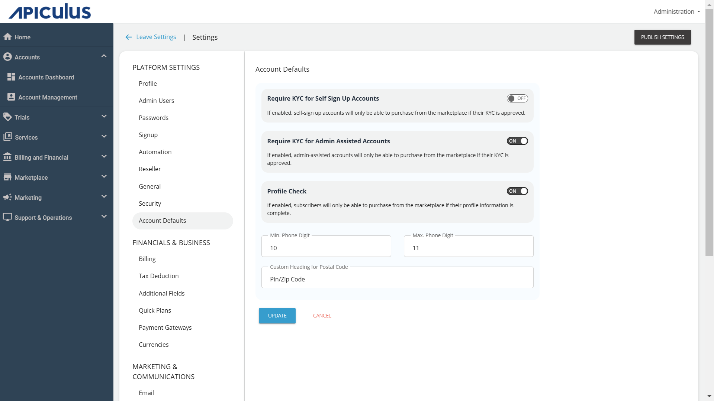
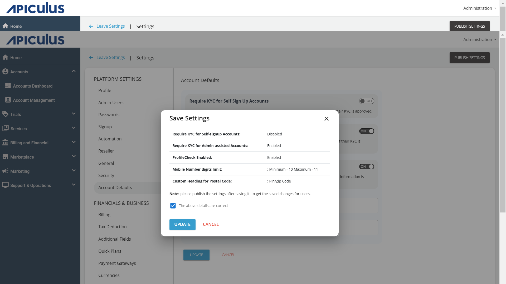

# Working with KYC and Account Verification

The Apiculus Admin Console allows to set up default KYC-based restrictions for both self-signup and admin-assisted accounts. When enabled, the respective account types will not be able to make purchases anything till their KYC/identity verification has been completed.

## Configuring KYC For Self-Signup Accounts

To configure KYC for self- signup accounts, admins need to perform the following steps on the admin portal.

1. Navigate to **Administration** > **Settings** > **Account Defaults**.
2. Turn on the **Require KYC for Self-signup Accounts**, then click the **Update** button.
3. The Save Settings screen appears where you can review your changes. Click **Update** to save the updated configuration.
4. Publish the saved settings by clicking the **Publish Settings** button in the top right corner.

:::note
This setting will apply to all accounts created using the self-signup method.
:::

## Configuring KYC For Admin-Assisted Accounts

To configure KYC for admin-assisted accounts, admins need to perform the following steps on the admin portal.

1. Navigate to **Administration** > **Settings** > **Account Defaults**.
2. Switch on the **Require KYC for Admin-Assisted Accounts**.
3. Click the **Update** button to save the updated configuration.
4. The Save Settings screen appears where you can review your changes. Click **Update** button to save the updated configuration.
5. Publish the saved settings by clicking the **Publish Settings** button in the top right corner.

:::note
This setting will apply to all accounts created through the administration console, or manually approved from the administration console. It will also apply to accounts created on external/other systems and imported into Apiculus using our MQ-based integration.
:::
## Actions Required for Self-Signup Accounts/Admin Assisted Accounts

Whenever newly created accounts login to the portal, they will see a popup message for KYC, and the restriction will be applied, preventing them from purchasing or activating any resources.

By clicking **OK** or **TAKE ME THERE**, the user will be redirected to the Basic section and automatically navigated to the **Documents** section. The appropriate document category must be selected, and the required should be uploaded for admin approval.

## Approval Of Documents

1. Once the customer/end-user uploads the documents, admins will receive an email notification.
2. Admins must then navigate to the specific **User Account** > **Documents** section under account management.
3. The customer/end-user will receive an email stating whether the document is approved or rejected. If the document is rejected, the reason for rejection will be provided in the email.
4. Once the documents are approved and the account is verified, the end user will receive an email stating that the identity verification process is complete.

Once the account reaches verified status, that is, KYC is now successfully verified, the subscriber/admin-assisted accounts can proceed with the activation/purchase of resources.

:::note
This is a global setting that will be applied to all the accounts globally after the settings have been published. For all accounts, there is a **KYC Required** field available in the account details. This field can be set to **YES** or **NO**, and it applies to individual accounts.
:::

