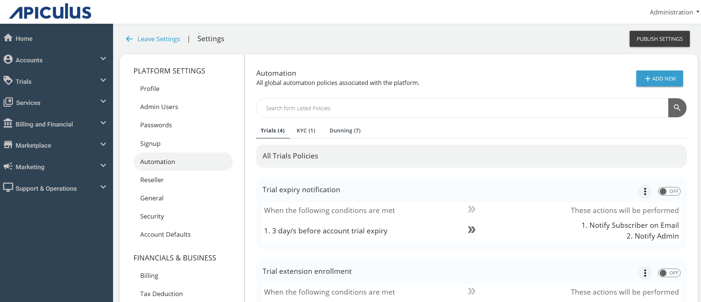

# Automating Trial Enrollments

The Apiculus automation policies support defining trial-specific triggers and actions. These can be used to run rich scenarios like auto enrollments on signup, ramped-up trials, marketing email sequences or even used in conjunction with KYC and dunning triggers.

:::note
Automation policies need to be of type **Trial** to have all trial triggers available.
:::

Supported triggers (available only for automation policies of type **Trial**):

- **Account creation** - self-signup or admin-assisted
- **Account trial enrollment start date** - before, on or after
- **Account trial enrollment end date** - before, on or after
- **Subscription trial enrollment start date** - before, on or after
- **Subscription trial enrollment end date** - before, on or after
- **Expiry of selected trial programme** - on expiry of chosen trial programme

Supported actions (available for any automation policy type):

- **Enroll into account trial** - enrollment into specified account trial

## Sample Trial Automations

The below table describes some common scenarios that can be addressed using trial automation on Apiculus.

|Scenario|Trigger|Action|
|---|---|---|
|Automatically enroll all self-service accounts to 'default trial programme'|On self-service account signup|Enroll into trial programme - 'default trial programme'|
|Ramp up from 'trial30' (duration 30 days; 100% benefit) to 'trial15' (duration 15 days; 50% benefit)|On expiry of selected trial programme - 'trial30'|Enroll into trial programme - 'trial15'|
|Send automated trial expiry reminder email 2 days before any account trial programme ends|Account trial expiry with value '-3'|Notify on email

