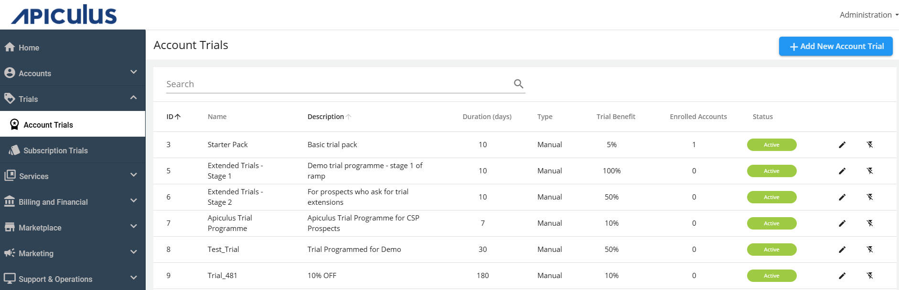
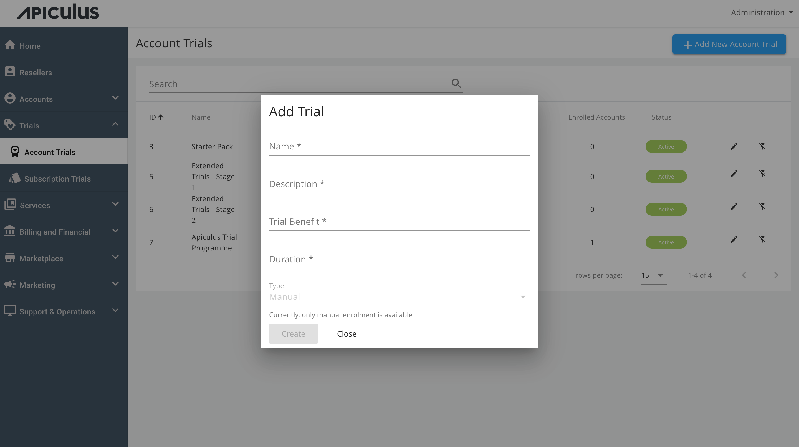
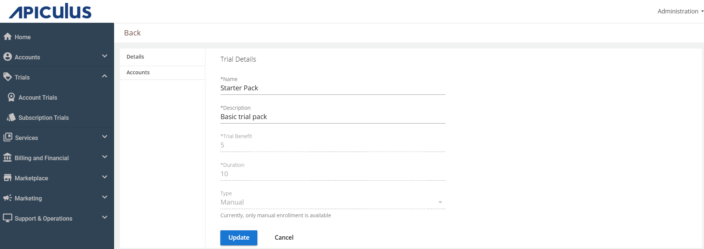
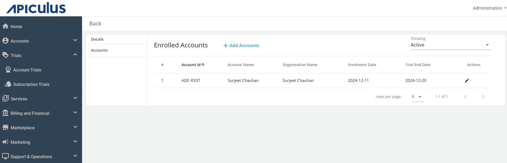
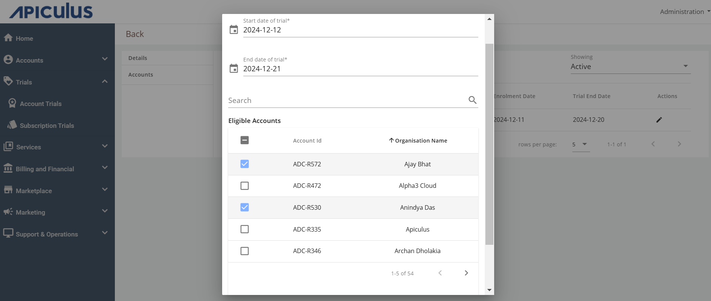
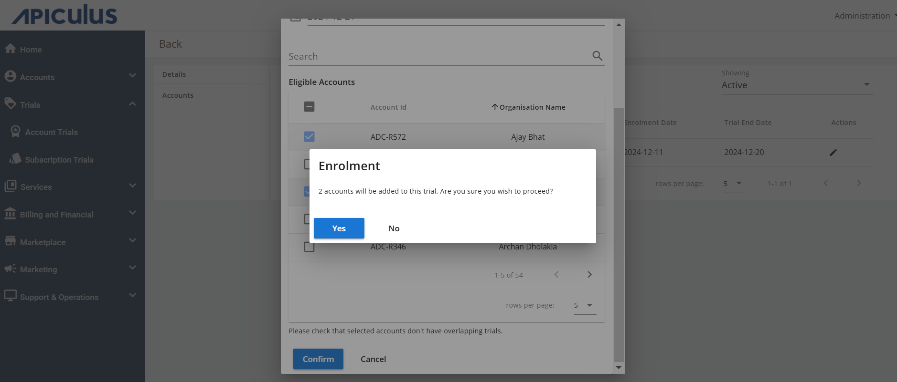
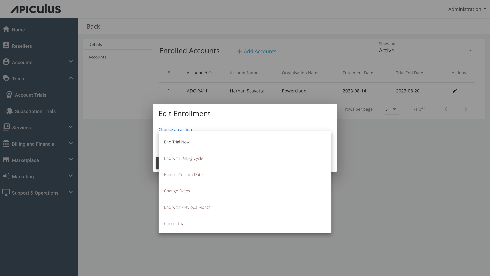

# Working with Account Trials

## Creating a New Account Trial Programme

To create a new trial programme, follow these steps:

1. Navigate to **Trials** > **Account Trials**.
2. Click on **+ Add New Account Trial** and enter the following details:
	- **Name of the programme** - Specify the name of the trial programme.
	- **Description** - You can add details or explanations about the trial programme.
	- **Trial Benefit** - Discount % is offered to the account that will enrol in this particular trial programme.
	- **Duration** -This is the time of the trial programme; Admins need to specify the days.
	
1. To create the trial programme, click on the **Create** button.

## Enrolling Accounts into Trial Programme
To add accounts in the created trial Programme, follow these steps:
1. Navigate to **Trials** > **Account Trials**.
2. Click on the edit icon (Pencil icon).
3. Click on **Accounts**.
4. Click on **Add Accounts**. 
5. Select accounts, and click on the **Confirm** button.
6. Select **Yes** to confirm.

Apiculus automatically takes care of overlapping trials and prompts the admin to take the most appropriate action while enrolling them.

## Editing Enrollment Options

Admins have various options to edit enrolled accounts like end trial now, end with billing cycle, end on custom date, end with the previous month, cancel trial etc.

- **End Trial Now** - This will un-enroll the account from the trial immediately and retain the benefits accumulated till now.
- **End with Billing Cycle** - This will keep the account enrolled till the end of the current billing cycle and not carry the enrollment into the next billing cycle.
- **End on Custom Date** - This will un-enroll the account from the trial on a specified date in the future.
- **Change Dates** - This can be used to edit the trial start and end dates.
- **End with Previous Month** - This option can be used if the account needs to be un-enrolled in the current billing cycle.
- **Cancel Trial** - This will remove the account from the trial and remove any accumulated benefits.

:::note
None of the above options will have any impact on benefits that have been applied and invoiced in previous months.
:::
