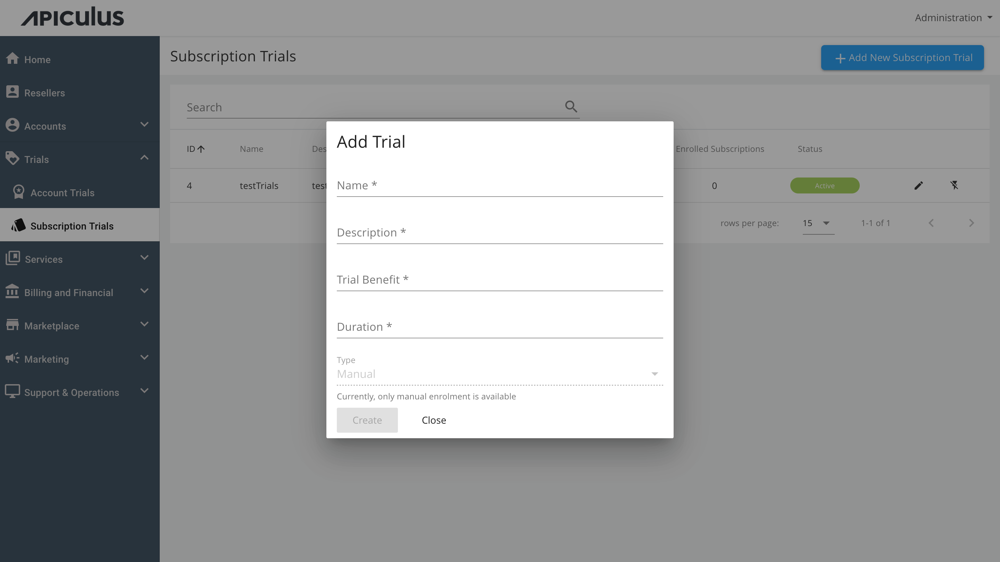
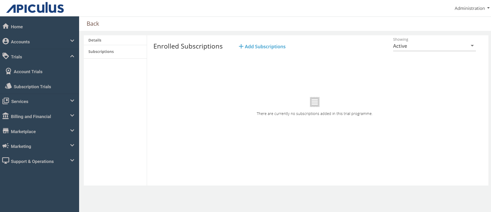
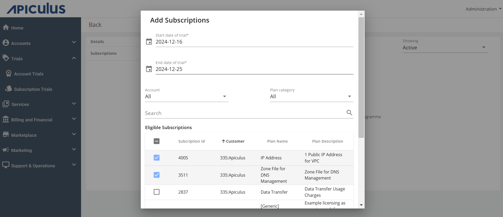

# Working with Subscription Trials

## Creating a New Subscription Trial Programme

To create a new subscription trial programme, click on **+ Add New Subscription Trial** and enter the below-mentioned details.

- **Name of the programme** - Specify the name of the subscription trial.
- **Description** - You can add details or explanations about the subscription trial.
- **Trial Benefit** - Discount % is offered to the account that will enrol in this particular trial programme.
-  **Duration** - This is the time of the trial programme; Admins need to specify the days.

To create the trial programme click on the CREATE button.

## Enrolling Subscriptions to Trial Programme

To add a subscription to the created subscription trial Programme, follow these steps:
1. Click on the **Edit** button to go inside the trial programme.
2. Navigate to **Subscriptions**.
3. Click on **+Add Subscriptions**.
4. Select the **Start date of trial** and **End date of trial**.
5. Select Eligible Subscriptions > Click on **Confirm** > Select **Yes** on the pop-up message.

:::note
A subscription needs to be created first before getting added to a subscription trial.
:::

## Updating Subscription Enrollments

Subscription enrollments can be updated in the same manner as [updating account trial enrollments](WorkingwithAccountTrials).

