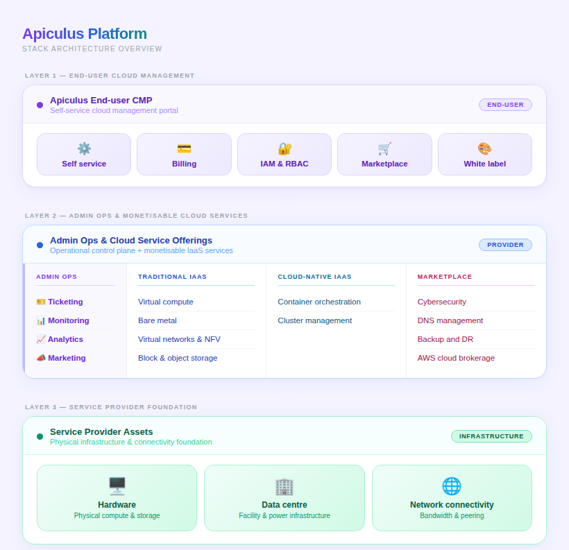

# Apiculus Stack

The Apiculus stack comprises of the following major layers:

- At the foundation layer of the Apiculus stack, the service provider assets includes, hardware, data centres, and network connectivity, which form the physical backbone of the cloud infrastructure. 
- At the middle layer, the platform enables admin operations and monetisable cloud service offerings, covering traditional and cloud-native IaaS, operational tools such as monitoring, ticketing, and analytics, as well as value-added services delivered through a marketplace.
- The topmost layer in the Apiculus stack includes the Apiculus Cloud Management Platform (CMP), demonstrating how cloud services managed and delivered from infrastructure to the end users. CMP provides self-service capabilities, billing, identity and access management, marketplace access, and white-label options, allowing customers to consume cloud services efficiently.

In the following Apiculus platform stack architecture diagram:
- **Layer 1**: This is the topmost layer and shows the Apiculus software capabilities..
- **Layer 2**: This is the middle layer and shows the services and extensions that can be monetised. 
- **Layer 3**: This layer at the bottom shows the service provider’s assets, which comprise the physical infrastructure and connectivity foundation.

