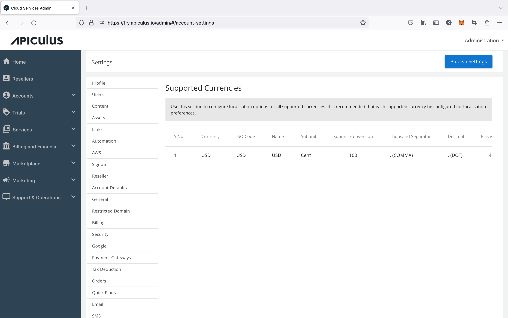
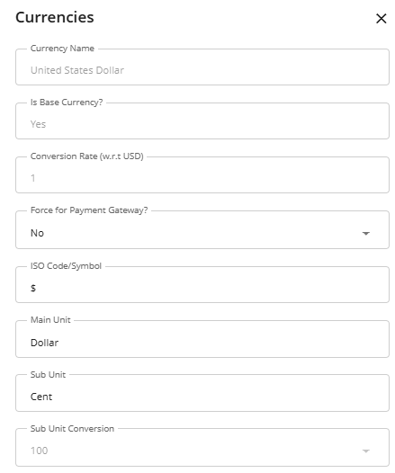

# Currency Localisation

All currencies can be localised for display and financial logic.

Navigate to **Administration** > **Settings** > **Financials & Business** > **Currencies**. This can help deliver localised experiences based on local and cultural considerations.

:::note
This section does not support adding new currencies. These settings are only for localisation of the currencies that are already set up. If you wish to add more currencies to your cloud setup, get in touch with IndiQus Support.
:::

The following settings can be controlled for configured currencies:

- **Currency** - The configured currency
- **ISO Code** - Specify the ISO code for the currency (USD, GBP, etc.)
- **Name** - Specify the currency name as singular (Dollar, Pound, etc.)
- **Subunit** - Specify the currency name as singular (Cent, Pence, etc.)
- **Subunit Conversion** - The conversion sub unit value
- **Thousand Separator** - Select the separator;  it can be (. )and (,)
- **Decimal** - Select the decimal place; it can be (. ) and (,)
- **Precision** - Select the precision value with values 0, 1, 2, 3, and as required
- **Vedic** - Select if Vedic is needed (x,xx,xxx vs. x,xxx,xxx)

1. Click on the edit icon at the end of the currency. The following screen appears:
   
2. Make the desired changes, and click the **Update** button.