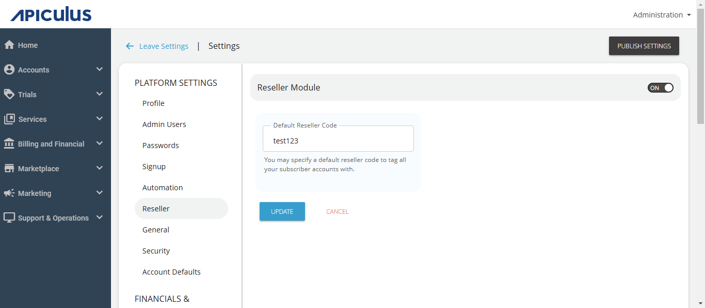

# Enabling Reseller Module

Apiculus ships with an experimental Reseller Module, which allows service providers to onboard subscribers/customers via a reseller partner. This is limited-functionality partner module, which enables the following:

1. Adding resellers to the system and assigning unique reseller codes to each.
2. Allowing end customers to signup using a valid reseller code to associate the account with the corresponding reseller.
3. Viewing basic reports for reseller-tagged accounts.

To enable the **Reseller Module**, navigate to **Settings > Reseller** and switch the setting to ON. The  Default Reseller Code field can be left blank to associate all signups directly with the service provider, or  any existing/available reseller code (from active resellers in the system) used as default.

:::note
Switching on this module will enable the Resellers menu item in the main navigation menu.
:::

:::note
This will not affect the end customer/subscriber experience.
:::

