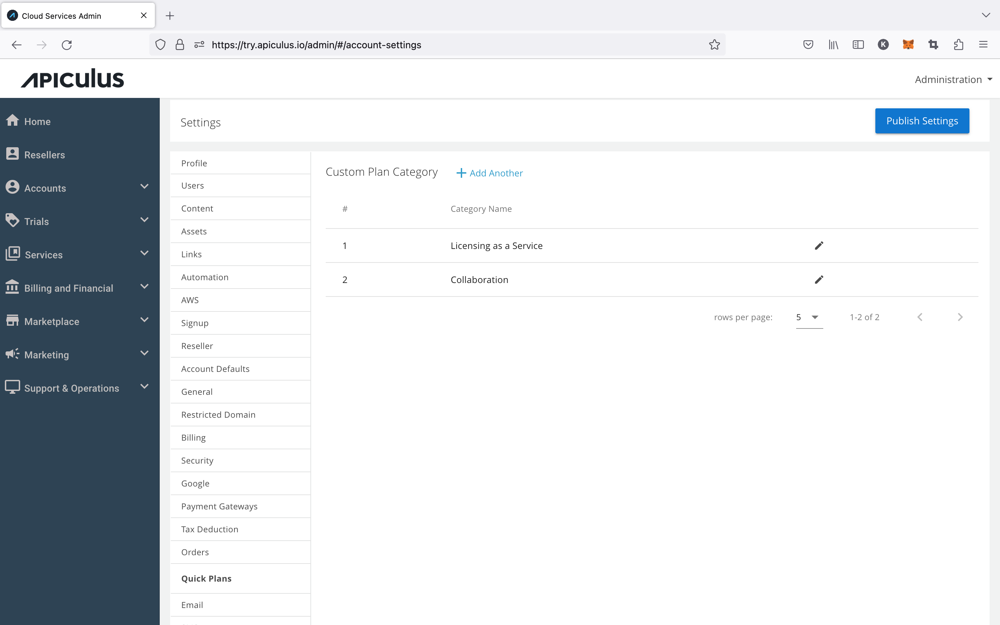

# Managing Quick Plan Categories

Apiculus Quick Plan categories can be set up and managed from **Settings > Quick Plans**. These categories allow for grouping Quick Plans visually and semantically under the Marketplace section on the Apiculus Cloud Console.

:::note
Once created, a Quick Plan category can not be deleted.
:::
