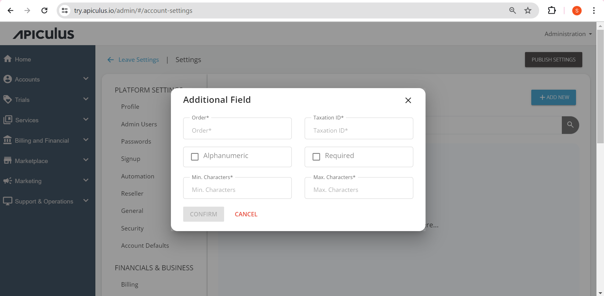

# Configuring Additional Fields

You can find the taxation IDs and custom profile fields that need to be associated with a subscriber account under **Administration** > **Settings > Financials & Business > Additional Fields** and can be edited along with the order. Additionally, you can define minimum and maximum characters, and the delete taxation IDs.

To add additional IDs:
1. Navigate to  **Administration** > **Settings > Financials & Business > Additional Fields**.
2. Click on **Add New** button. The Additional Field window opens. 
3. Enter the required details, and click **Confirm**.

