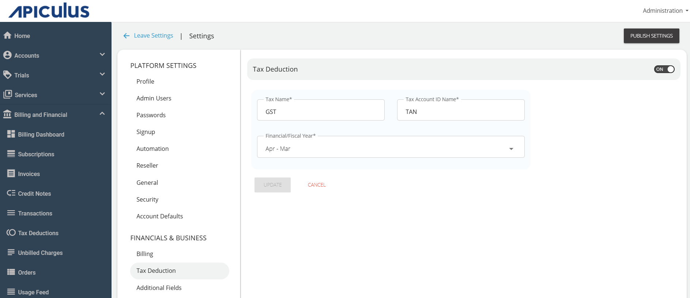

# Configuring Tax Deductions

Apiculus supports recording quarterly tax deductions for all customer invoices. The Tax Deductions section lists all such tax deductions and allows for adding new items. The Tax Deductions feature is optional and needs to be enabled from the global settings, where admins also get the ability to define their country’s fiscal period and fiscal quarters. 

To configure tax deductions, follow these steps:
1. Navigate to **Administration** >  **Settings > Financials & Business > Tax Deduction**.
2. Enable the **Tax Deduction** switch and provide the following details:
	- Enter the **Tax Name** as applicable.
	- Enter the **Tax Account ID Name**.
	- Select the quarter from the **Fiscal/Financial Year** drop-down list.
3. Click on **Save** and then click **Publish Settings**.

:::note
Once set up, tax deductions can be recorded via Subscriber Account Management.
:::
