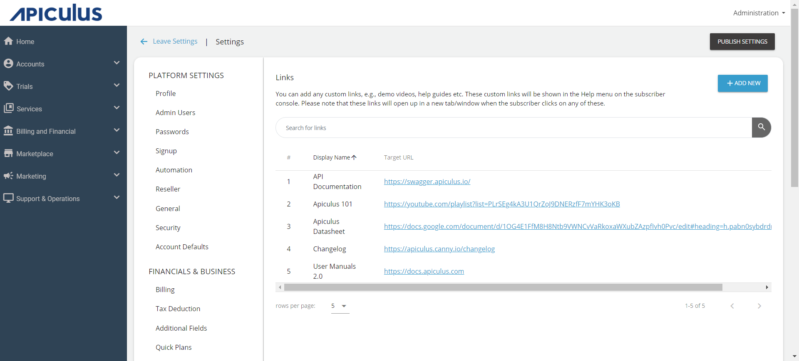
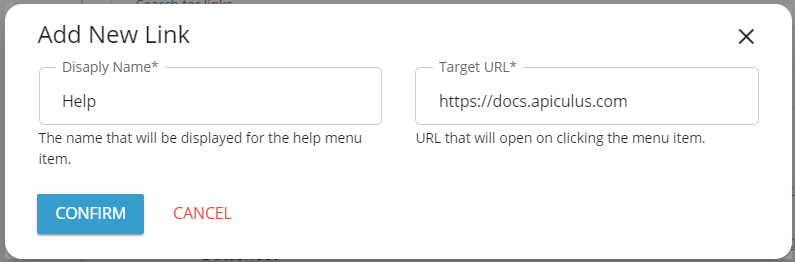

# Configuring Custom Links

You can add custom links such as demo videos, help guides, etc. These custom links will be shown on the subscriber console. Note that these links will open up in a new tab/window when the subscriber clicks on them. 

## Adding Custom Links

1. Navigate to **Administration** > **Settings** > **Links**. The following screen appears:
   
2. Click on the **Add New** button. The Add New Link window opens.
    
3. Enter the **Display Name** and the **Target URL**.
4. Click **Confirm**.

## Editing and Deleting Custom Links
1. Navigate to **Administration** > **Settings** > **Links**. 
2. Click on the three-dots icon  at the end of the custom link for the following options:
	- **Edit** the custom link.
	- **Delete** the custom link.

