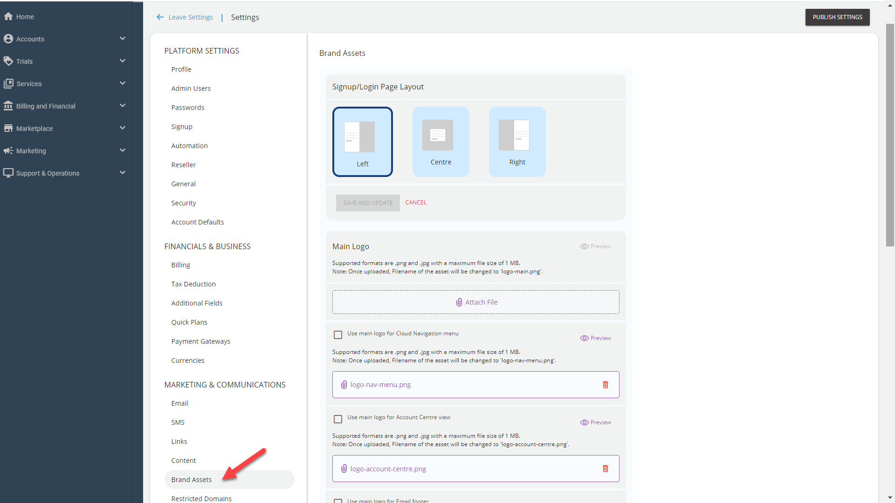
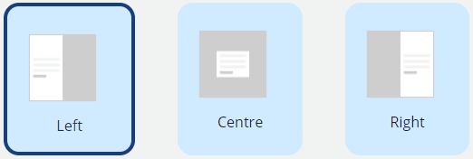
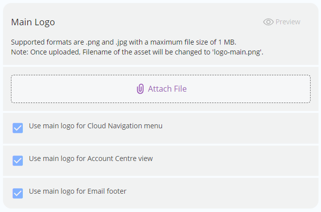
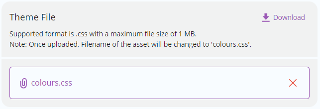
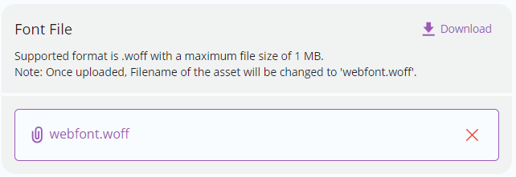

# Customising Brand and Graphic Assets

You can customize your cloud to match your branding; 100% white labeling is possible. So right from the logo, fonts to the email footer are easily configurable. 

Navigate to **Administration** > **Settings** > **Brand Assets** to customise brand and graphic assets.

### Signup/Logon Page Layout
Select the layout for the signup/login page by clicking on the respective icon.

|                                                                                                                      |                             |
| -------------------------------------------------------------------------------------------------------------------- | --------------------------- |
| > Form on left; banner on right   > Form in centre; banner as background   > Banner on left; form on right |  |

### Main Logo

You can view and delete the existing logo and upload a new one to match your branding requirements. 

Click on the **Attach File** button to upload the logo. 

You can use the Main Logo for the Cloud Navigation, Account Center, and Email footer by selecting the respective check boxes.

### Favicon

You can view and delete the existing favicon and upload a new favicon to match your branding requirements. 

Click the **Attach File** button to upload a new favicon.

### Banner

You can view and delete the existing banner and upload a new banner to match your branding requirements. 

Click the **Attach File** button to upload a new Banner.

### Theme

You can edit the existing theme to match your branding requirements. 

Click the **Download** button to download the theme customisation kit in _.css_ format and edit it to match your branding requirements. Then, click on the **Attach File** to upload the .css file.

You can modify the theme customisation kit (.css) to define the following:

- Brand colour palette (primary, secondary and tertiary colours)
- Standard colour palette (red, green, blue, orange etc.)
- Greyscale colour palette (white/0%, 5%, 25%, 50%, 75%, 95% and black/100% greys)
- Navigation panel colour palette
- Login/signup page colour palette

### Fonts

The system supports .woff files for fonts. 

You can edit existing font file (.woff) to match your branding requirements. 

Click the **Download** button to download the fonts file and make the desired modifications. Then, click on the **Attach File** button to upload the modified font file. 

:::note
The correct font licenses should be procured by the service provider.
:::

