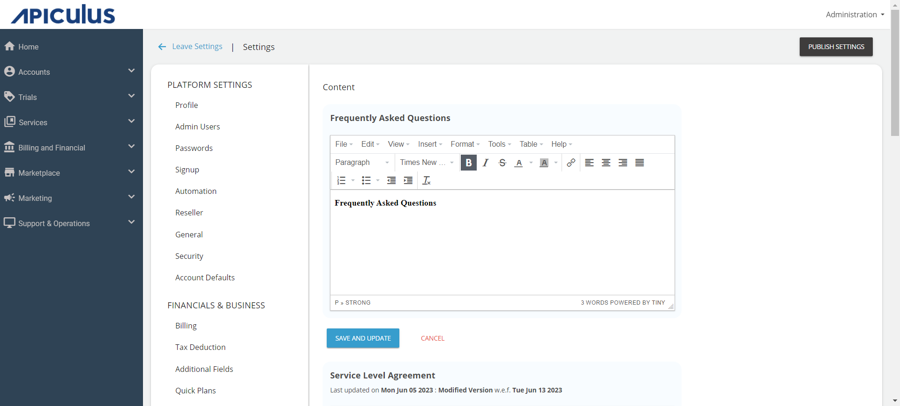
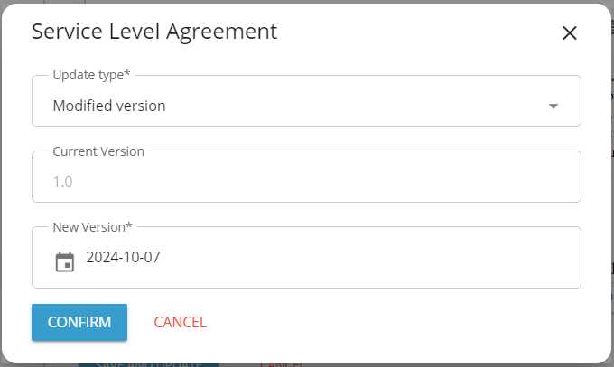

# Publishing Standard Static Content

You can configure the static content that the users can view from their portal. This content is helpful in information and lets the user know about the service provider’s EULA, SLA, privacy policy, etc. You need to type or paste the content into the respective sections to update it. If a policy is updated or a newer version is uploaded, then the updated date and time are captured, and this information is sent to the users via email.

Navigate to **Administration** > **Settings** > **Content** to customise the standard static content.

Apiculus includes a built-in content versioning and management system. Each time a static content document is updated, the system triggers an acceptance from all subscribers and admin users.
## Updating Standard Content/Policies

To update the standard content/policies:

1. Navigate to **Content**.
2. Navigate to the section that requires modification:
	- **Service Level Agreement** 
	- **End User License Agreement**
	- **Privacy Policy**  
3. Make the desired changes.
4. Click on **Save and Update**. The following screen opens:   
4. Select **Update Type** (**New version** or **Modified version**) and the document update date.
5. Click on **Confirm**. 

Once the policy type is updated, all admins and customers will be sent an email informing them about the policy update changes, along with the link to the updated policy.

Whenever a customer logs in after the policy update, the customer needs to accept the updated policy by clicking on the acceptance checkbox; otherwise, they won’t be able to do anything on the portal.
