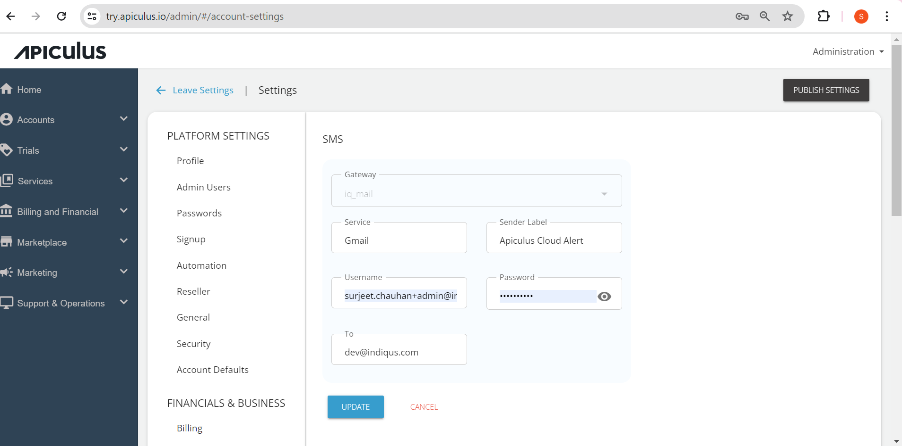

# Configuring SMS Gateway

The SMS gateway is a in-built Apiculus application that enables messages and notifications to be sent to end customers via SMS. 

The following are the steps to configure SMS gateway:

1. Navigate to **Administration** > **Settings > Integrations > SMS**.
 
   The following screen appears:
   
2. Click on the **Edit Details** button and make the desired changes.
3. You can edit the following fields:
	- Service
	- Sender Label
	- Username
	- Password
4. Click **Update**.
5. Click **Publish Settings**.

