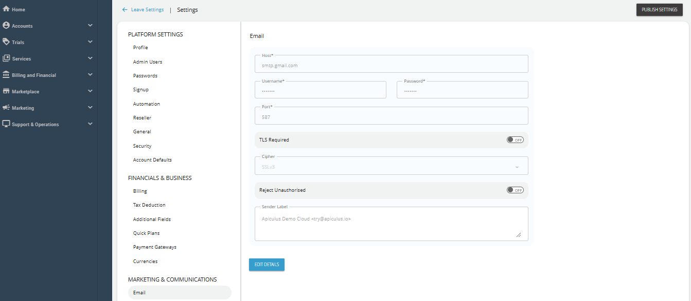

# Configuring System Emails using SMTP

Apiculus CloudConsole is the topmost layer on a technology stack that is fine-tuned and Apiculus delivers all system-generated emails, messages and notifications using SMTP. Any valid email address can be set up as the system email sender using standard SMTP settings.

1. Navigate to **Administration** > **Settings > Marketing & Communications > Email**.
   
2. Click on the **Edit Details** button and make the desired changes.
3. Click **Update**.
4. Click **Publish Settings**.

