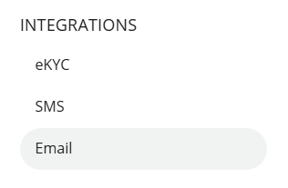

# Configuring System Emails using SMTP

Apiculus Cloud Console is the top layer of the technology stack that is fine-tuned and Apiculus delivers all system-generated emails, messages and notifications using SMTP. Any valid email address can be set up as the system email sender using standard SMTP settings.

The following are the steps to configure the email integration:

1. Navigate to **Administration** > **Settings > Integrations > Email**.
   
   The following screen appears:
	
2. Click on the **Edit Details** button and make the desired changes.
	
3. You can edit the following fields:
	- Host
	- Username
	- Password
	- Port
	- TLS required
	- Cipher
	- Reject Unauthorised
	- Sender Label
4. Click **Update**.
5. Click **Publish Settings**.

