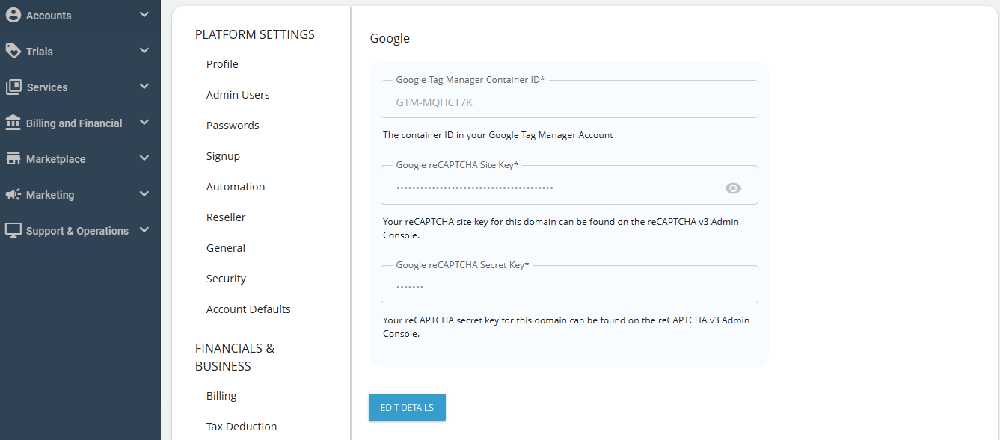

# Managing Google reCAPTCHA and Tag Manager

Apiculus supports form protection and marketing stack integration as in-built apps using [Google reCAPTCHA](https://www.google.com/recaptcha/) and [Google Tag Manager (GTM)](https://tagmanager.google.com/) respectively.

The corresponding credentials can be obtained from the Google reCAPTCHA admin (site key and secret key) and Google Tag Manager account (GTM container ID) dashboards and used with Apiculus. 

1. To manage the credentials, navigate to **Administration** > **Settings > Extensions > Google**.

   
2. Click on the **Edit Details** button and make the desired changes.
3. Click **Update**.
4. Click **Publish Settings**.

:::note
Apiculus supports Invisible reCAPTCHA v2 only. **Using reCAPTCHA is mandatory** while using GTM is optional.
:::