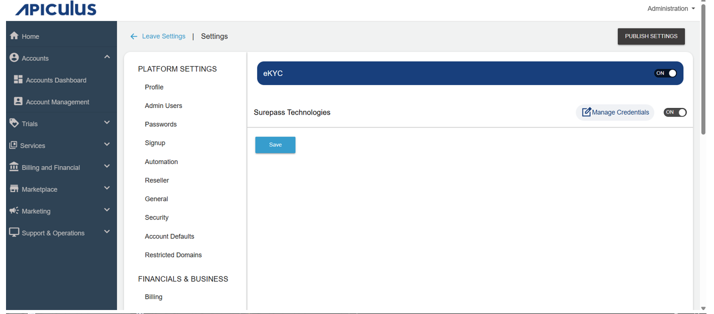
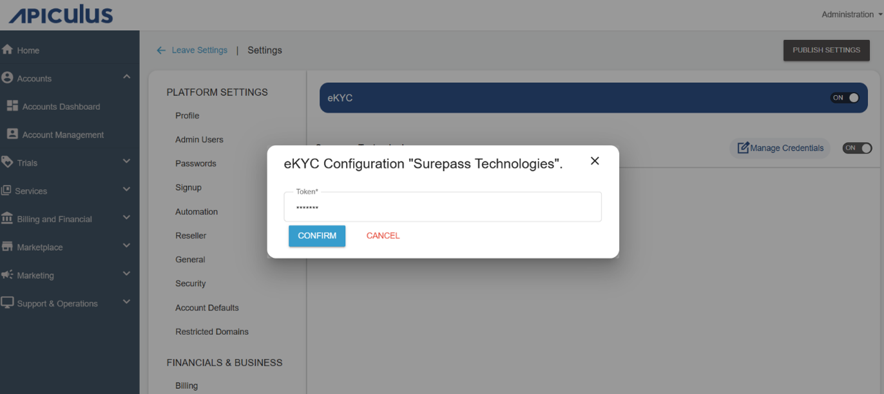

# eKYC

eKYC is an integrated solution that enables administrators to activate the eKYC service for subscribers. It reduces manual effort and significantly shortens approval time for administrators by allowing identity verification to be completed digitally. This integration streamlines the KYC process and enhances platform security while ensuring faster and seamless user verification.

The following are the steps to enable the eKYC:

1. To configure eKYC, navigate to **Administration** > **Settings > Integrations > eKYC**. The following screen appears:
  2. Enable the **Surepass Technologies** option.
  3. Click the **Manage Credentials** option, and the following pop-up appears:
    
  4. Enter the **Token**. Click **confirm**.
  5. Click **Save**.
  6. Click **Publish Settings**.