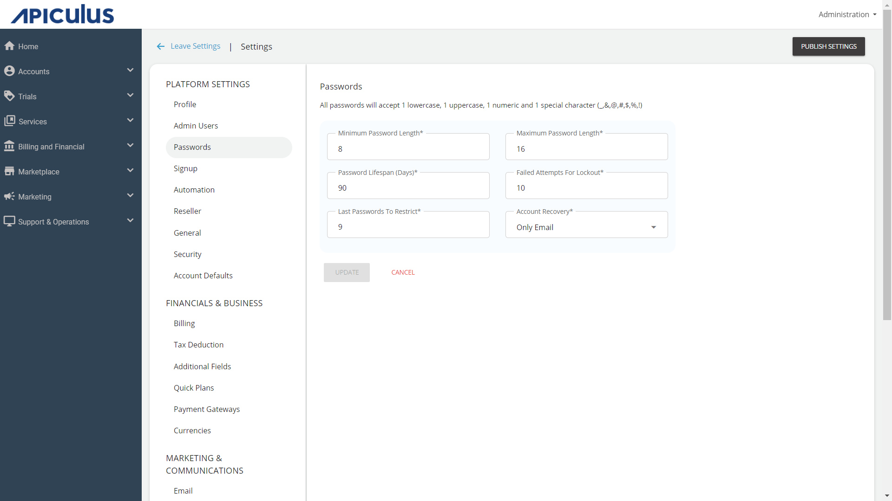

# Configuring Password Policies
Apiculus platform admins can set up password policies from **Administration** > **Settings** >  **Passwords**. A host of controls is available to set up password policies, including:

- **Minimum Password Length** - the minimum number of characters required for a secure password.
- **Maximum Password Length** - the maximum number of characters required for a secure password.
- **Password Lifespan Days** - the number of days after which password needs to be reset.
- **Failed Attempts For Lockout** - failed attempts after which the account should be locked out.
- **Last Passwords To Restrict** - the number of last-used passwords that can not be reused.
- **Account Recovery** - account recovery via email and mobile; mobile available if SMS gateway is set up.

:::note 
All passwords will accept at least one lowercase, one uppercase, one numeric, and one special character (_, &, @, #, $, %, or !).
:::
