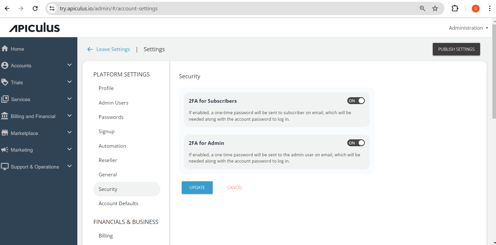

# Login Security and 2FA

You can set up two-factor authentication (2FA) for subscribers and admins separately. If selected, a one-time password (OTP) is sent via email to the users attempting to log in. Additionally, if an SMS gateway is enabled and configured, the OTP is also be sent to the user's registered mobile phone.

