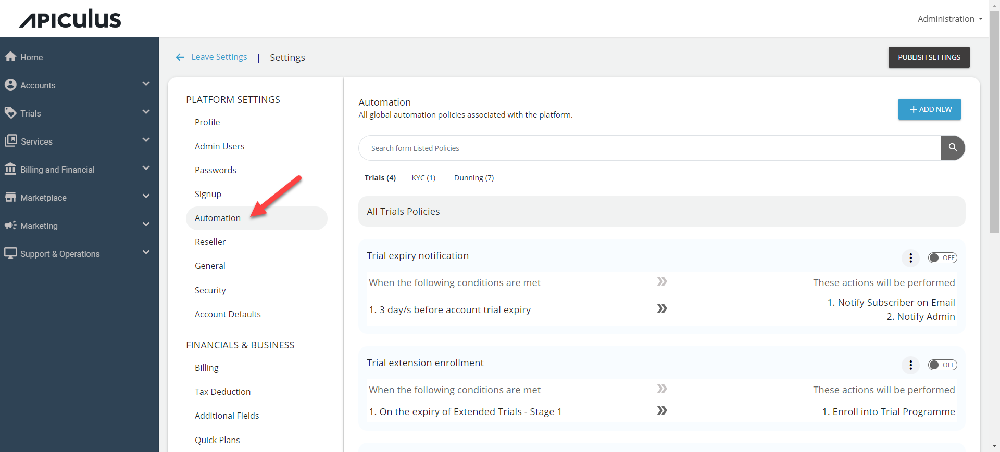
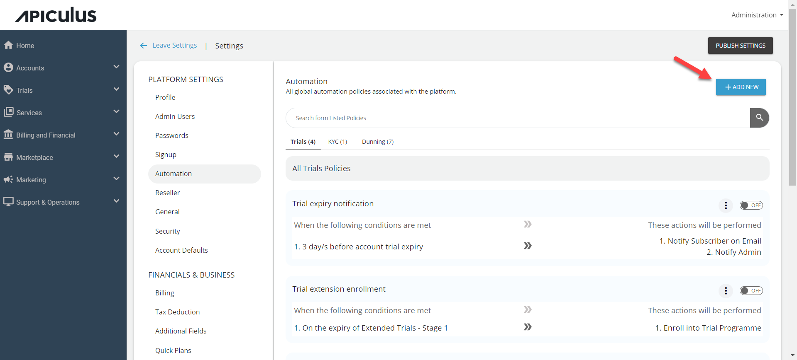
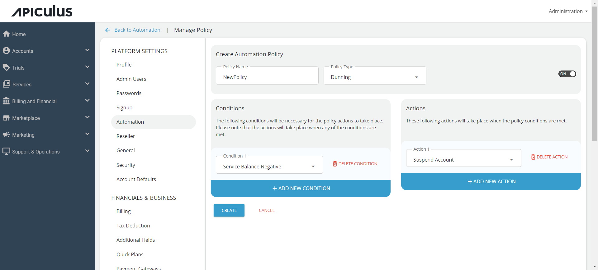
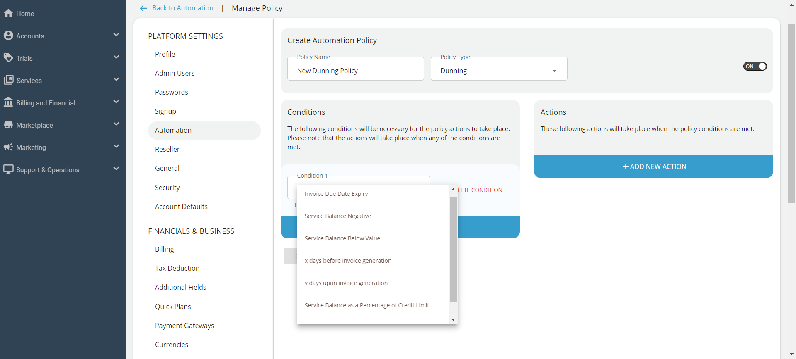
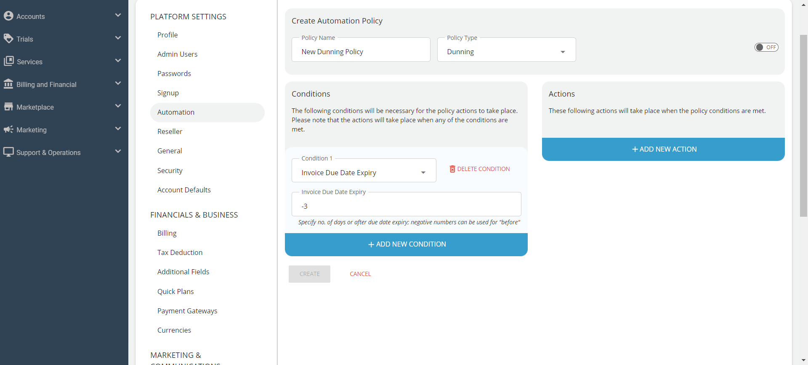
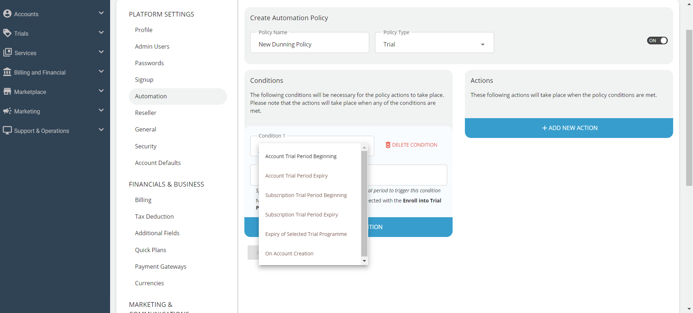
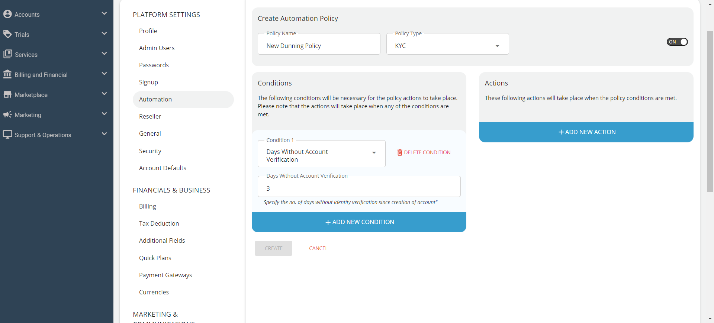
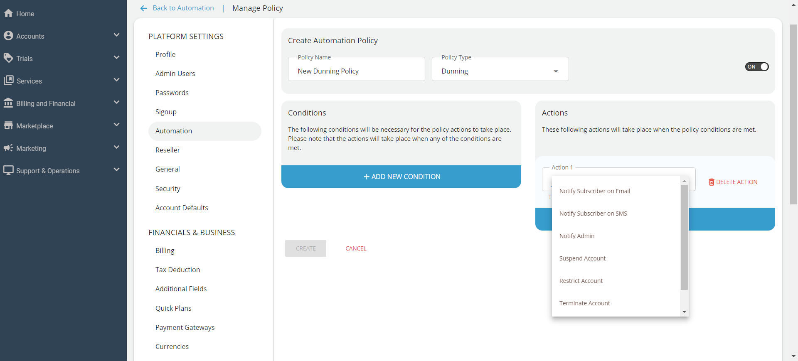
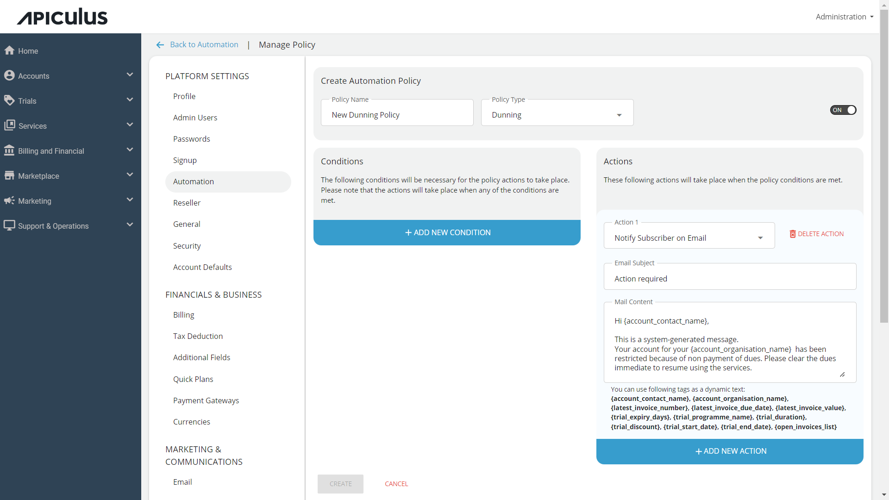

# Configuring Automation Policies

Apiculus allows service providers to define automation policies and workflows to handle scenarios around invoice reminders, non-payments, and customer identity verification.

Navigate to **Administration** > **Settings** > **Automation** to configure automation policies.

## Creating an Automation Policy

Account actions can be automated by creating automation policies that trigger an action based on a trigger condition. These policies can be created globally, which are applied to all new subscriber accounts and can also be overridden for individual accounts.

1. To create a new automation policy, click on **Add New** button.
      
2. The Create Automation Policy screen opens:
	  
1. Enter the desired **Policy Name**.
2. Select the **Policy Type**. The following are the available options:
	- Dunning
	- Trial
	- KYC
3. Configure the [Conditions](#configuring-conditions) and [Actions](#configuring-actions).
4. Click **Create**.	
## Configuring Conditions

The actions are triggered when the configured conditions are met.

Click on **Add New Condition** and select a condition from the drop-down list.
### Dunning Conditions
The following conditions are available when you select **Dunning** as the **Policy Type**.

- Due date expiry of an invoice
- Negative service balance
- Service balance below a fixed value
- Number of days before the invoice is generated
- Number of days upon invoice generation
- Service balance as a percentage of the credit limit
- Transaction balance as a percentage of the credit limit

The following is an example of a configured **Dunning** condition trigger that checks for **3 days before invoice due date.**

### Trial Conditions
The following conditions are available when you select **Trial** as the **Policy Type**.

- Account Trial Period Beginning
- Account Trial Period Expiry
- Subscription Trial Period Beginning
- Subscription Trial Period Expiry
- Expiry of Selected Trial Programme
- On Account Creation (self-sign up or admin-assisted accounts)

### KYC Conditions
The following conditions are available when you select the **KYC** as the **Policy Type**.

- No. of days without account verification.

## Configuring Actions
Actions are triggered based on the conditions.

To configure an action, click on **Add New Action**.

The following are the options available:

- Notification via email
- Notification via SMS
- Notify admin
- Suspend account
- Restrict account from new purchases
- Terminate account and delete all resources
- Enroll into Trial Programme

For notification actions (email and sms), you can use smart tags to insert dynamic data in the content. The following are the available Smart tags:

| Action                  | Smart Tag                     |
| ----------------------- | ----------------------------- |
| Primary contact name    | `{account_contact_name}`      |
| Organisation name       | `{account_organisation_name}` |
| Latest invoice number   | `{latest_invoice_number}`     |
| Latest invoice due date | `{latest_invoice_due_date}`   |
| Latest invoice value    | `{latest_invoice_value}`      |
| Days to trial expiry    | `{trial_expiry_days}`         |
| Trial programme name    | `{trial_programme_name}`      |
| Trial duration          | `{trial_duration}`            |
| Trial discount/benefits | `{trial_discount}`            |
| Trial start date        | `{trial_start_date}`          |
| Trial end date          | `{trial_end_date}`            |
| List of open invoices   | `{open_invoices_list}`        |

The following is an example of a **Notify Subscriber on Email** action using **smart tags**.

