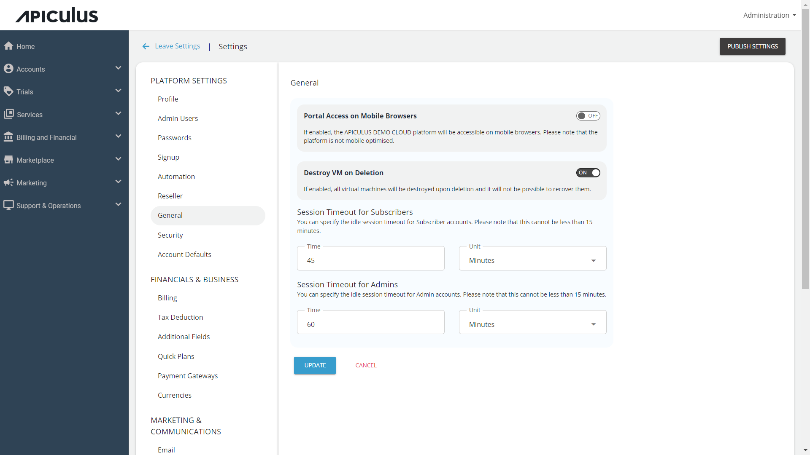

# General Platform Settings
Navigate to **Administration** > **Settings** > **General** to configure the general portal settings:
1. **Portal Access on Mobile Browsers** - Use the toggle button (On/Off) to enable/disable portal access on mobile browsers.
   :::note
	The Apiculus platform UI is **not** mobile-optimised.
	:::
1. **Destroy VM on Deletion** - Use the toggle button (On/Off) to enable/disable the option to destroy the VM on deletion.
2. **Session Timeout for Subscribers** - Configure the session timeout for subscribers (**Time** and **Units**).
3. **Session Timeout for Admins** - Configure the session timeout for admins (**Time** and **Units**).
4. Click **Update**.

