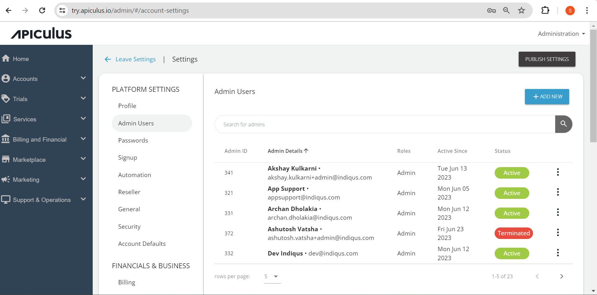

# Managing Service Provider Admin Users

Navigate to **Administration** > **Settings > Admin Users** to view all the administrators with their roles. In addition, specific SP teams can be onboarded with restricted administrative access using [Service Provider Admin RBAC](/docs/AboutServiceProviderAdministration/Role-basedAccessonAdminConsole). RBAC is a highly flexible access management system that can be configured differently for each service provider. Service providers can specify the actions allowed for different user types, and the entire setup can be configured accordingly.

The admin user’s list comprises the following details:

- **Admin ID** - The ID associated with an account.
- **Admin Details** - This displays the name and email ID associated with the account.
- **Roles** - This specifies the role associated with an account.
- **Active Since** - Day and date of the account creation.
- **Status** - This shows the present status of the particular administrator user. It can be active or terminated.
## Adding New Admin User

To add a new admin user:
1. Click on the **Add New** button. The Add New Admin window opens.
   

2. Enter all the essential information, and click **Confirm**.
## Editing Admin User's Details
To edit existing user details:  
Click on the three-dots icon   against the admin user whose details you want to edit, and click **Edit**. The Edit Account window opens where you can edit the details.

:::note
You can edit only the First Name, Last Name, Phone Number, and Role.
:::
## Deleting Admin User
To delete existing admin user's details:  
1. Click on the three-dots icon   against the admin user you want to delete, and click **Delete**. The following screen appears:
   
   
2. Click on **Yes, Delete**.

