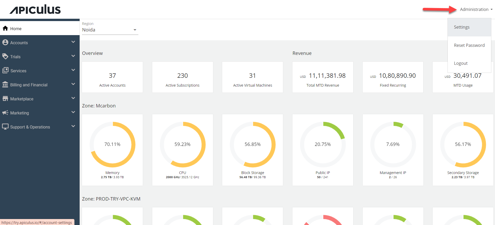
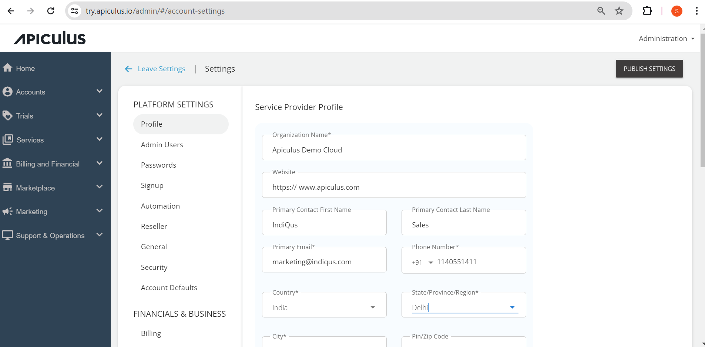

# Managing Service Provider Profile

The profile consists of all the service provider (SP) details; admins can configure all the details straight from the name of the cloud they will offer as to the address. 

To manage the service provider profile, navigate to **Administration** > **Settings**.

The following screen appears:

Under Profile, enter the following details, and click **Update**.

- **Organization Name** - The name of the cloud by which service provider wants to deliver the services in the market.
- **Website** - Specify the URL of the organization website.
- **Primary Contact Name** - Enter the service provider’s contact person’s name.
- **Primary Email** - Specify the service provider’s email address.
- **Primary Number** - Specify the service provider’s phone number.
- **Address** - Enter the service provider’s address and the Zip code.

<iframe
  width="100%"
  height="395"
  src="https://www.youtube.com/embed/0E4HDhdJ1d0?rel=0&modestbranding=1&autoplay=0&controls=1"
  frameborder="0"
  allow="accelerometer; autoplay; clipboard-write; encrypted-media; gyroscope; picture-in-picture; fullscreen"
  allowfullscreen>
</iframe>
