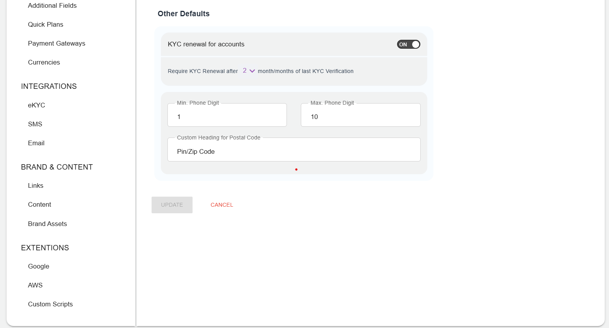

# Configuring Account Defaults

Account defaults include the various configurations that are applied once an account is created successfully. For example, it can be KYC needed for self-signup accounts, or it can be the minimum or maximum number associated with the account as required or any other check like profile check enabled. 

To configure account defaults, navigate to **Administration** > **Settings** > **Account Defaults**. The following screen appears:
1. Organisation

Configure following details as per your requirements:
- **Require KYC for Organisation Accounts** - If this option is enabled, self-signed up accounts can purchase or activate any resource from the marketplace only when their KYC is approved.
- **Organisation Profile Check** - If this option is enabled, then the subscriber first needs to complete their profile, Only then will they be able to purchase resources from the marketplace.
2. Individual
- Require KYC for Individual Accounts - If this option is enabled, then Subscriber can purchase from the marketplace, only when their KYC is approved.
- Individual Profile Check - if this option is enabled, then Subscriber can purchase from the marketplace, only if their 

