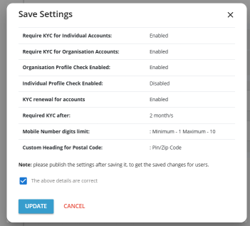

# Configuring Account Defaults

Account defaults include the various configurations that are applied once an account is created successfully. For example, you can mandate the KYC for organisation and individual accounts, or profile information must be complete before an individual or organisation purchases from the marketplace.

To configure account defaults, navigate to **Administration** > **Settings** > **Account Defaults**. The following screen appears:

Configure the following details as per your requirements:

1. **Oragnisation**  
	 - **Require KYC for Organisation Accounts** - If this option is enabled, organisation accounts can purchase or activate any services, only when their KYC is approved.  
	 - **Organisation Profile Check** - If this option is enabled, organization accounts must complete their profile before they can purchase any services.
2. **Individual**  
	 - **Require KYC for Individual Accounts** - If this option is enabled, individual accounts can purchase or activate any services, only when their KYC is approved.  
	 - **Individual Profile Check** - If this option is enabled, individual accounts must complete their profile before they can purchase any services.
 3. **Other Defaults**  
    You can set the following other default settings for the account:  
	 - **KYC renewal for accounts** -  If this option is enabled, you can set the number of months after which the user must renew their KYC based on the last verification.  
		 :::note  
		  The customer will receive an email notification when their KYC renewal is about to expire. Refer to the [KYC renewal](/docs/Subscribers/AccountCentre/KYCrenewal) section for more details.  
		 :::  
	 - **Min. Phone Digit** - The minimum digits can be specified for a phone number associated with the account.  
	 - **Max. Phone Digit** - The maximum digits can be specified for a phone number associated with the account.  
	 - **Custom Heading For Postal Code** -If your country of operations uses a different nomenclature for postal codes, you can specify that here.

To publish the KYC configuration, follow these steps:
1. Click **Update**, and the following pop-up screen appears:
	
2. Verify the details and click **update**.
3. Click the **Publish settings** button.

