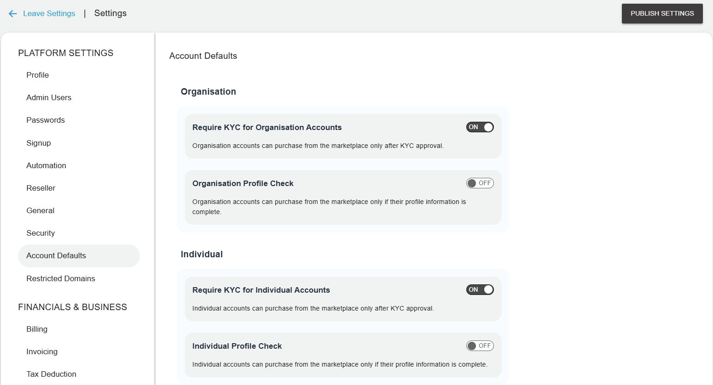

# Configuring Account Defaults

Account defaults include the various configurations that are applied once an account is created successfully. For example, it can be KYC needed for self-signup accounts, or it can be the minimum or maximum number associated with the account as required or any other check like profile check enabled. 

Navigate to **Administration** > **Settings** > **Account Defaults**. The following screen appears:

The following are the options that you configure as account defaults:

- **Require KYC for Self Sign Up Accounts** - If this option is enabled, self-signed up accounts can purchase or activate any resource from the marketplace only when their KYC is approved.
- **Require KYC for Admin Assisted Accounts** - If this option is enabled, all admin-assisted accounts will purchase or activate any resource from the marketplace only when their KYC is approved.
- **Profile Check** - If this option is enabled, then the subscriber first needs to complete their profile, Only then will they be able to purchase resources from the marketplace.
- **Minimum Phone Digits** - The minimum digits can be specified for a phone number associated with the account.
- **Maximum Phone Digits** - The maximum digits can be specified for a phone number associated with the account.
- **Custom Heading for Postal Code** - If your country of operations uses a different nomenclature for postal codes, you can specify that here.

