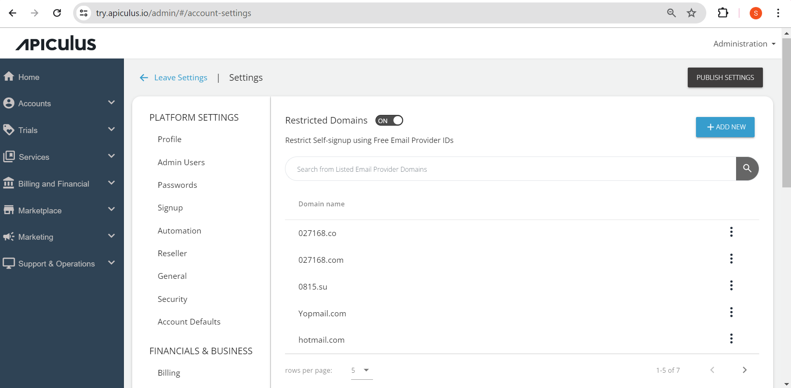

# Restricting Free Email Domains

Apiculus allows restricting account signups from free email providers and other custom domains. 

To restrict free emails domains:

1. Navigate to **Administration** > **Settings** > **Restricted Domains**. The following screen appears:
   
2. Click on the **Add New** button. The Add New window opens:
   
3. Enter a domain or a comma-separated list of domains that you want to restrict.
4. Click **Confirm**. 

