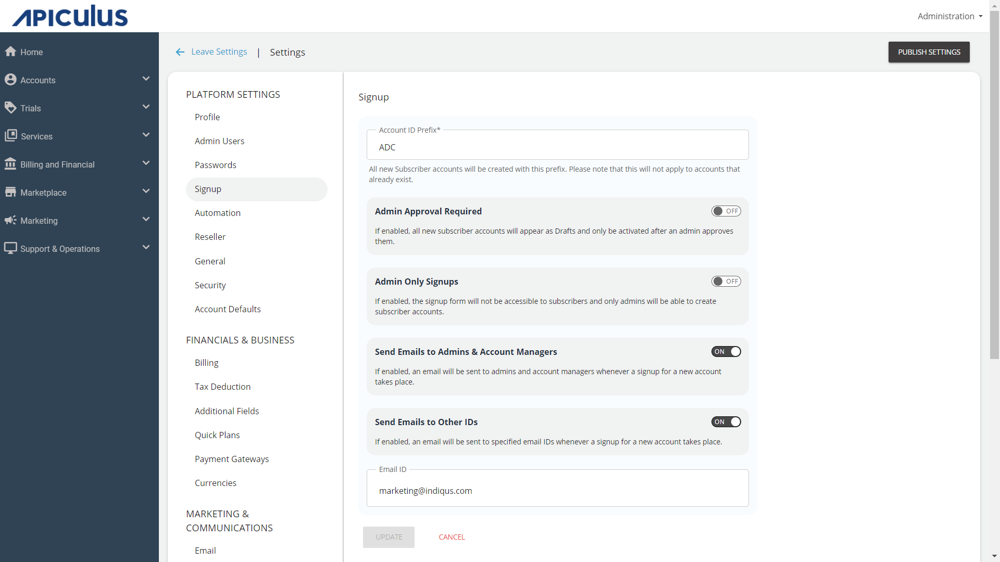

# Signup Settings

You can customise signup settings as per your need. For example, you want that on an account signup, you want to be notified, (receive an email) or your customer’s account ID should start with a particular choice of sequence.

From signup settings, you can make the configurations regarding account signup that include both self-signup and admin-assisted accounts.

To configure signup settings, navigate to **Administration** > **Settings** > **Signup**. The following screen appears:

Configure following details as per your requirements:
- **Account ID Prefix** - Specify the prefix for the accounts. By default, all account IDs will start with this defined prefix.
- **Admin Approval Required** - If this option is enabled, all account signup requests will show up as draft accounts and will be published only after admin approval.
- **Admin Only Signups** - If this option is enabled, the self-signup form will be disabled and only admins will be able to create the subscriber accounts.
- **Send Emails to Admins & Account Managers** - If this option is enabled, an email will be sent to admins and account managers whenever signup for a new account happens.
- **Send Emails to Other IDs** - If this option is enabled, all the specified email IDs will receive an email whenever a new account signup happens.

