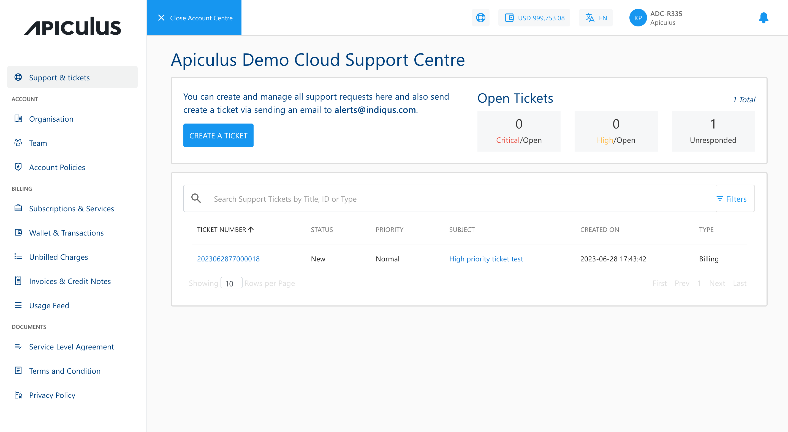

# About Apiculus Account Centre

The **Account Centre** on the Apiculus Cloud Console is a non-technical (commercial and support) dashboard used for viewing and managing all non-technical aspects of your Apiculus Cloud account. You can access the Account Centre by clicking on any item in the user menu at the top-right, the help/support icon in the header, or the wallet icon in the header.

The Apiculus Cloud Console provides a one-click view switcher between the **Account Centre** and the **Cloud Dashboard**.

