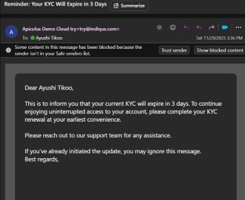
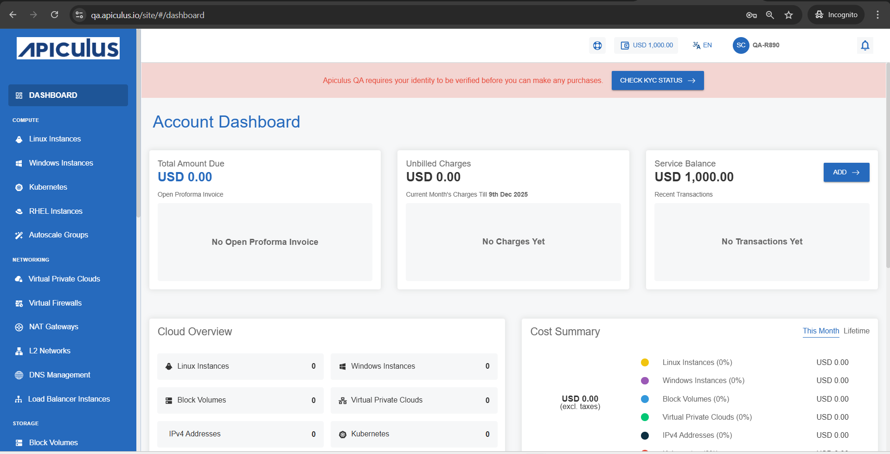

# KYC Renewal

You will receive the following email notification when your KYC details are about to expire.
	
You will also get the KYC expire notification on your dashboard.
	
	
To renew your KYC, follow these steps:
1. Click the **check KYC status** button on your dashboard. The following screen appears:
2. Click the **Add Document** or [Start eKYC](/docs/Subscribers/AccountCentre/eKYC) button.