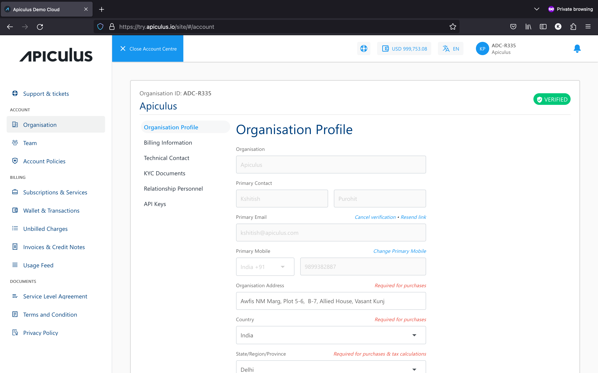
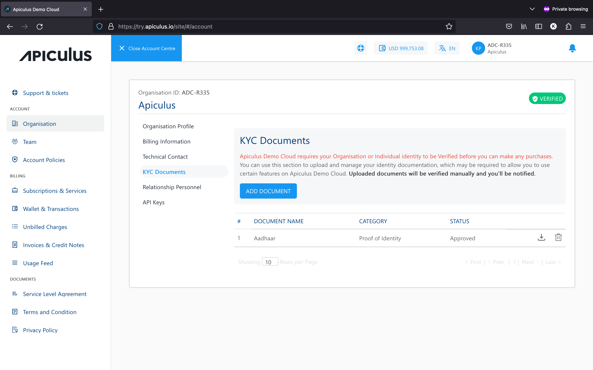

# Organisation/Account Profile

Using the **Profile** section, you can manage your organisation account profile on Apiculus Cloud. The profile management section can be accessed from the **Account Centre** in the top helper bar by clicking on the organisation.. Account profiles include the following:

1. **Details -** These are the basic demographic details of your organisation. All editable fields can be updated at any time.
	
2. **Billing Information -** These are the billing details of your organisation, such as billing address, taxation ID, etc.
   
3. **Technical Contact -** These are the details for billing and technical contacts of your organisation. 
   
	:::note 
	These contacts are not child users and do not receive login credentials
	:::
4. **KYC Documents -** This section can be used to upload various organisational documents, e.g., company registration information, taxation ID documents, proofs of address, etc. 
	:::note 
	Apiculus might require these documents to allow continued usage of the cloud services.
	:::
	
	
5. **Relationship Personnel -** This section will show the point of contact details that have been assigned to your account by the service provider.
   

## KYC Renewal

The subscriber will receive the following email notification when their KYC renewal is about to expire.
	
To renew your KYC , click the **Add Document** or [Start eKYC](/docs/Subscribers/AccountCentre/Organisation-AccountProfile#ekyc) button.

## eKYC

To start your eKYC, follow these steps:

1.  Navigate to **Account Centre > KYC Documents**. The following screen appears:
	
2. Click **Start eKYC.** 
	- **For individual account** -
		1. Enter your Aadhar number. Click **Send OTP**.
			
		2. Enter the **OTP** your received on your registered mobile number and email-id.
		3. Click **Confirm**.
			
		4. If subscriber has different billing details in the database and Aadhar, then the following pop-up appears:
			
		5. You can proceed with Billing information (current) or information from Aadhar. Click **proceed with new information**.
				
	- **For organisation account**-
		1. Enter your GSTIN number. Click **Send OTP**.
			
		2. Enter the **OTP** your received on your registered mobile number and email-id.
		3. Click **Confirm**.
			
		4. If subscriber has different billing details in the database and GSTIN, then the following pop-up appears:
			
		5. You can proceed with Billing information (current) or information from GSTIN. Click **proceed with new information**.
			