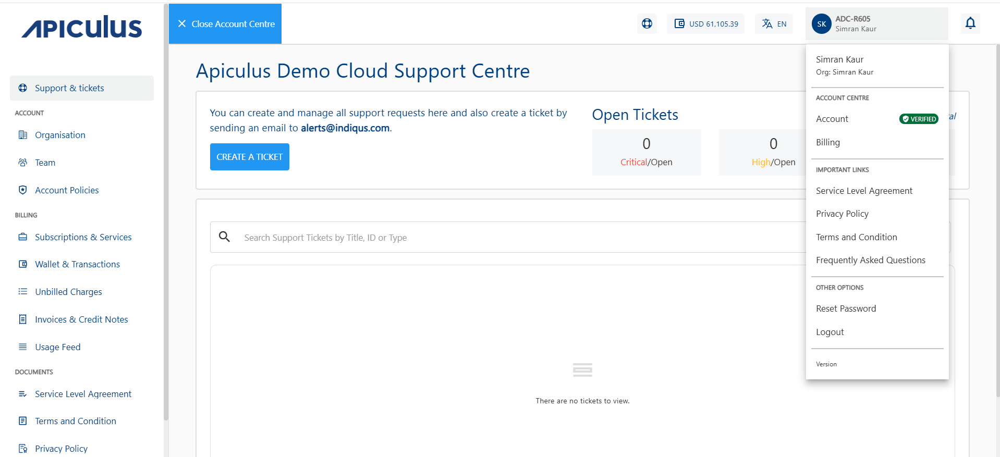

# Standard Agreements
Standard agreements and documents are available on the Apiculus Cloud Console Account Centre. Whenever any of these documents is amended or updated, you will be prompted to accept the modified documents on your next login.

To access the following documents, navigate to the User icon in the top helper bar and select the document under **IMPORTANT LINKS**:

- Service Level Agreement
- Terms and Conditions
- Privacy Policy
- Frequently Asked Questions (optional)
  
  

