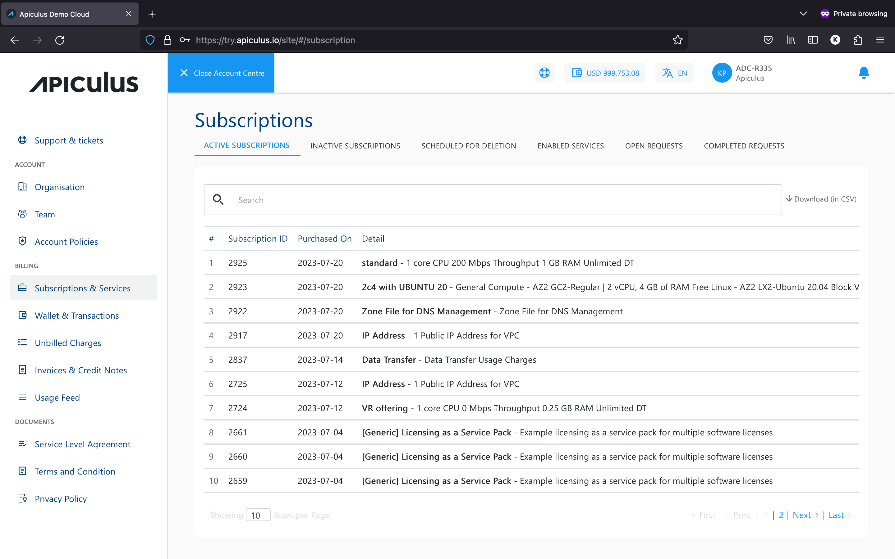

# Subscriptions and Services

A subscription is a record that gets created whenever a new resource is purchased or a service is activated. In other words, a subscription is a financial ‘agreement’ that links the item that has been purchased, its value, and its renewal frequency.

Subscriptions have the following characteristics:

- By default, all subscriptions are set to renew automatically at the end of their billing durations.
- By default, all subscriptions are set to prorate on entry as well as on exit. This means that subscriptions created or deleted in the middle of a billing cycle will only be charged partly and not for the whole billing month.
- Subscriptions can be canceled (or deactivated) at any time. However, while canceling, you’ll have the option to delete the subscription immediately (instant deletion) or just cancel the automatic renewal (scheduled deletion).

Apiculus Cloud supports the following types of subscriptions:

- **Fixed recurring -** These have a fixed charge for a fixed period and are automatically renewed with the same fixed charges.
- **Usage -** These are metered (mostly) in an hourly fashion and are billed on the number of usage hours.
- **Fixed non-recurring -** These have a fixed one-time charge and do not require renewal.

Subscriptions can be accessed by clicking on **Billing  > Subscriptions & Services** in the main navigation panel of the account centre. This section shows the following information:

1. **Active Subscriptions -** a tabulated list of all subscriptions that are currently active in your account.
   :::note
   The data transfer and secondary storage subscriptions are always enabled by default.
   :::
2. **Inactive Subscriptions -** a tabulated list of all subscriptions that were active in the past. This includes all removed subscriptions.
3. **Scheduled for Deletion -** a tabulated list of all subscriptions that are set not to renew automatically.
	

