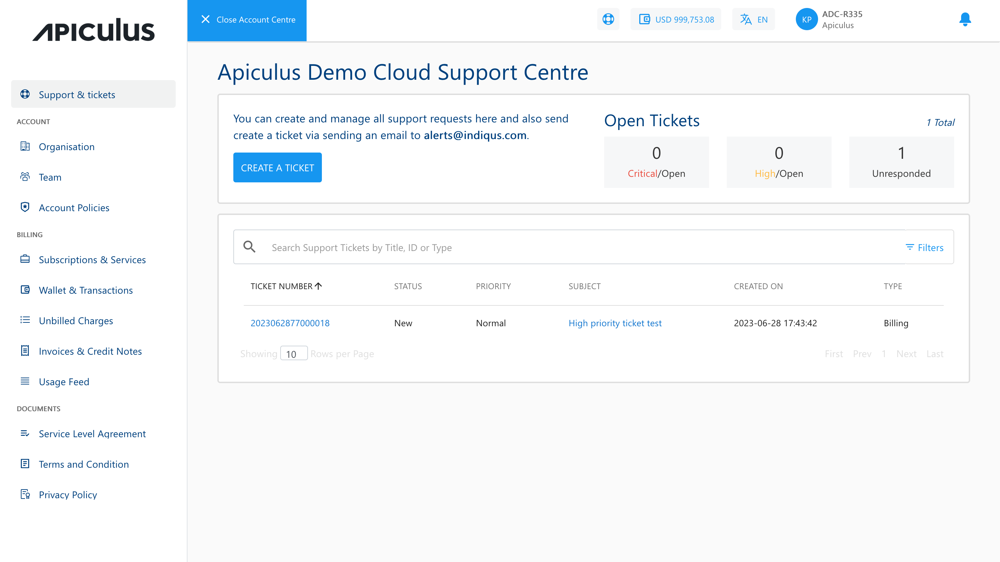
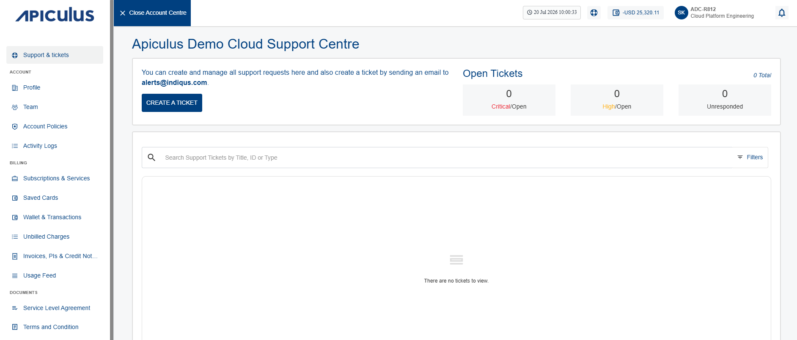
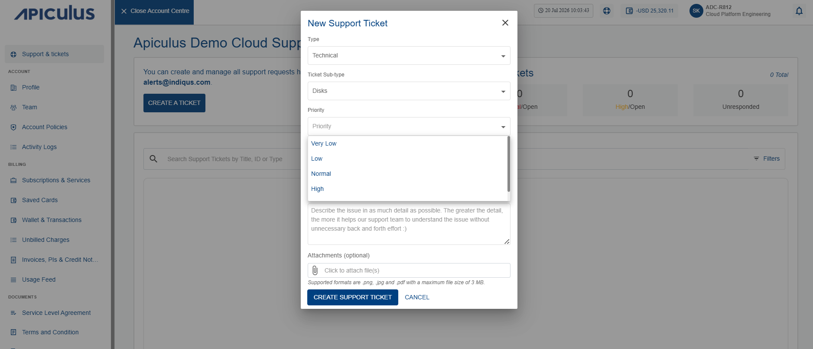
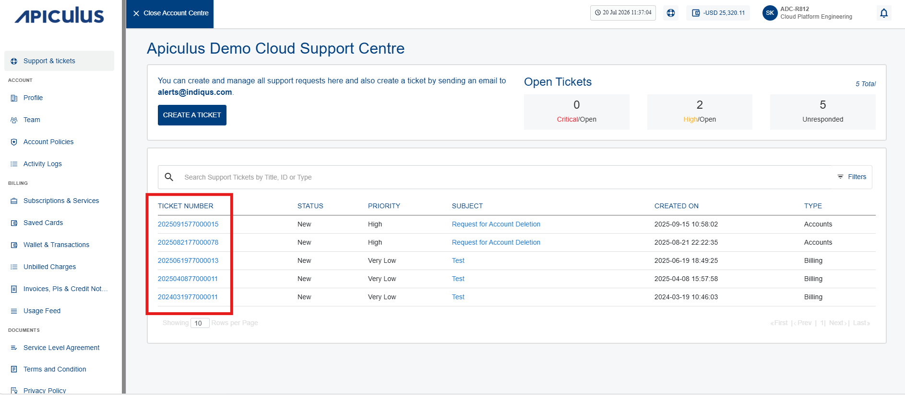
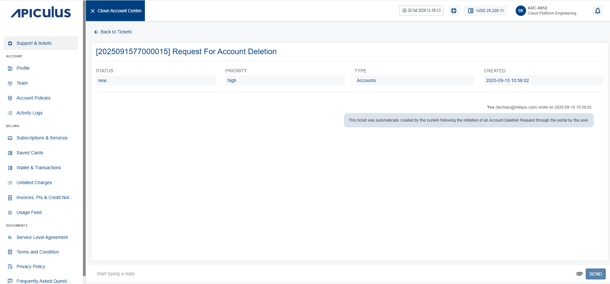

# Support and Tickets
Apiculus Cloud provides SLA-driven support to all subscriber customers in accordance with the terms and conditions outlined in the Service Level Agreement. To access the SLA, navigate to the User icon in the top helper bar and select Account under Account Centre.

## Creating a Support Ticket

To create a support ticket, follow these steps:
1. Click the **Support & Tickets** menu. The following screen appears:
	
2. Click the **Create a Ticket** button. The following screen appears:
	
3. Provide the following details:
- **Type:** This is a high-level classification in terms of Account, Billing, Technical, or another issue.
- **Category:** Select the appropriate category (For example: Accounts, Antivirus, Apache SQL Injection Attack, Backup) based on the ticket type.
- **Ticket Sub Category:** Select the appropriate subcategory according to the selected category.
- **Priority:** You can choose a priority level for your ticket: Very Low, Low, Normal, High, or Critical.
- **Subject:** Based on the type provide a relevant subject to your ticket that pinpoint exactly which item you’re having an issue with.
- **Details:** You should provide as much information as possible for Apiculus’s support agents to be able to diagnose your issue better.
- **Attachments:** Optionally, you can also attach a .png, .jpg, or .pdf file as an attachment.
4. Click the **Create Support Ticket** button.

After successfully creating the ticket, you get a notification email and a separate email containing the ticket details on your registered email id. You can use the ticket information to track the request and communicate with the support agent(s).
## Communicating with an Agent
To communicate with an agent, follow these steps:

1. Click **Ticket Number** (highlighted in red).
	
	The following screen appears:
	
2. Enter your message in the textbox. You can also upload attachments along with your message.
3. Click **Send**.

You can also reply directly to the email containing the ticket information or the latest response from the support agent.
# Ticket Classifiers

Please refer to the following table for a quick reference on ticket classifiers:

|   |   |   |
|---|---|---|
|**Type**|**Sub-type**|**Item**|
|Billing|Transactions|List of transactions to choose from|
||Invoices|List of invoices to choose from|
||Statements|List of statements to choose from|
||Other|-|
|Technical|Virtual Machines|List of VMs to choose from|
||Virtual Private Clouds|List of VPCs to choose from|
||Disks|List of root and addon volumes to choose from|
||Other|-|
|Account|Active Subscriptions|List of active subscriptions to choose from|
||Inactive Subscriptions|List of inactive subscriptions to choose from|
||Users|List of child users to choose from|
||Other|-|
|Other|-|-|

