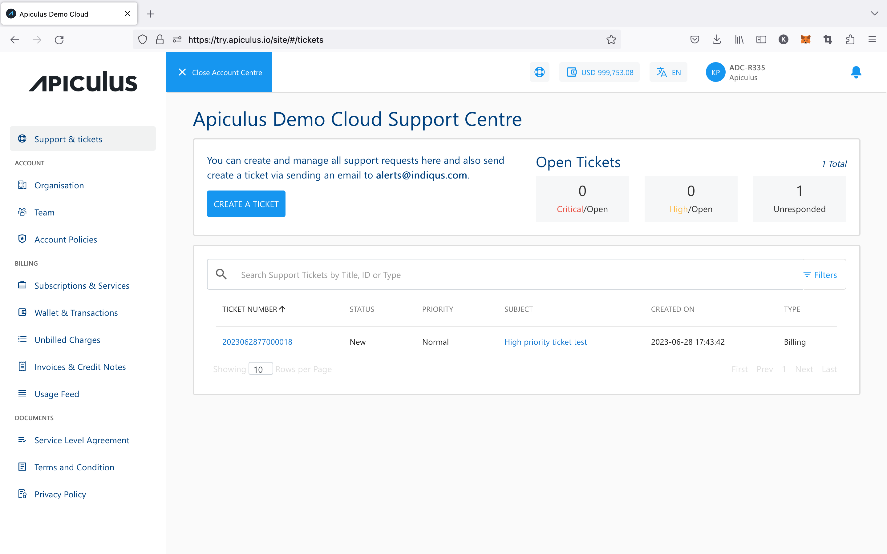
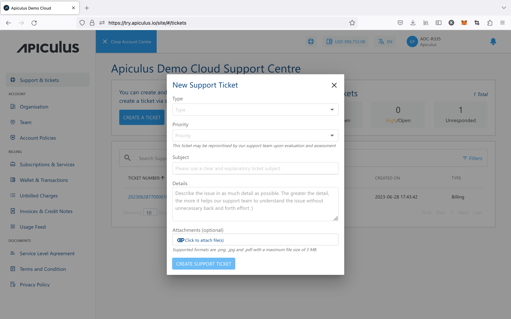

# Support and Tickets
Apiculus Cloud provides SLA-driven support to all subscriber customers in accordance with the terms and conditions outlined in the Service Level Agreement. The SLA can be accessed from the top helper bar by clicking on the user icon.

## Creating a Support Ticket

The Apiculus Cloud Console has a ticketing section that can be accessed by clicking on **Support & Tickets** in the main navigation panel of the Account Centre. The tickets section shows a list of all the tickets in your account and lets you filter the view based on ticket priority and ticket status.

To open the ticket creation dialog box, click the **CREATE A TICKET** button in the left corner. Ticket creation follows the single-form interaction paradigm where all the relevant information is captured intelligently in one place to create the ticket. The ticket creation dialog will show the following options:

- **Type:** This is a high-level classification in terms of Account, Billing, Technical, or another issue.
- **Priority:** You can choose a priority level for your ticket: Very Low, Low, Normal, High, or Critical.
- **Subject:** Based on the type provide a relevant subject to your ticket that pinpoint exactly which item you’re having an issue with.
- **Details:** You should provide as much information as possible for Apiculus’s support agents to be able to diagnose your issue better.
- **Attachments:** Optionally, you can also attach a .png, .jpg, or .pdf file as an attachment. Please note that the size limit on ticket attachments is 3 MB.

Creating a ticket will send you a notification email and another email with ticket information that can be used to track and communicate with the support agent(s). Both emails will be received at your email address on record.

## Replying to an Agent

You may reply to the assigned support agent from the ticket interface by using the message box at the bottom of the ticket. Ticket replies also support uploading attachments.

Alternatively, you can reply to the email that you received with the ticket information or the latest reply from the support agent. Email replies will also show up in the ticket details section on Apiculus Cloud Console.

# Ticket Classifiers

Please refer to the following table for a quick reference on ticket classifiers:

|   |   |   |
|---|---|---|
|**Type**|**Sub-type**|**Item**|
|Billing|Transactions|List of transactions to choose from|
||Invoices|List of invoices to choose from|
||Statements|List of statements to choose from|
||Other|-|
|Technical|Virtual Machines|List of VMs to choose from|
||Virtual Private Clouds|List of VPCs to choose from|
||Disks|List of root and addon volumes to choose from|
||Other|-|
|Account|Active Subscriptions|List of active subscriptions to choose from|
||Inactive Subscriptions|List of inactive subscriptions to choose from|
||Users|List of child users to choose from|
||Other|-|
|Other|-|-|

