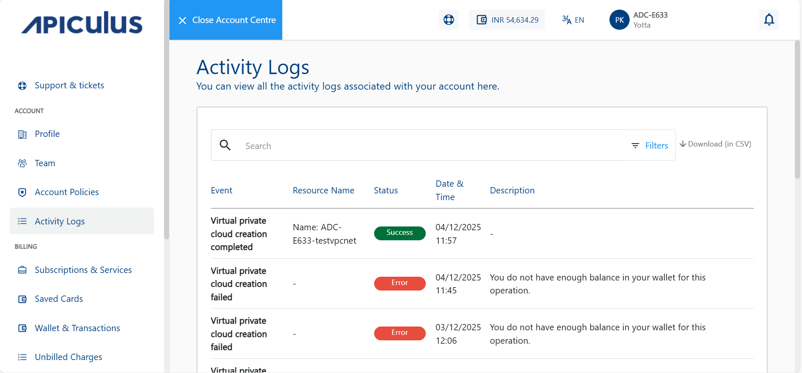

# View Activity logs
The Activity Logs section provides subscribers with a detailed record of actions performed within their cloud environment. To improve usability, enhanced filtering options have been implemented.

1. Click the **Account** tab from the external ID dropdown. The following screen appears:
   
2. Click the **Activity Logs** tab in the left-hand panel. The following screen appears:
   
    - Use the search bar at the top of the logs table to quickly search logs or events by keywords, resource names, or actions.
    - Click the **Filters** button to view logs from the **Last 24 Hours**, **Last 7 Days**, or a **Custom Date Range**.
    - Click the **Download (in CSV)** option to export the activity logs in CSV format for offline review.

