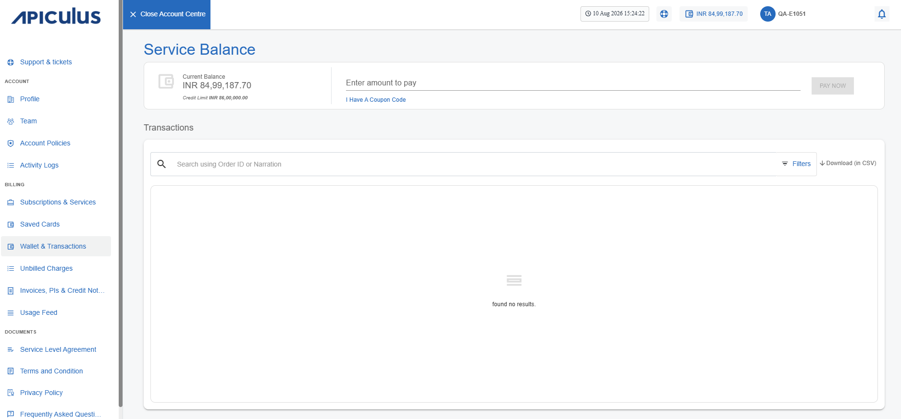
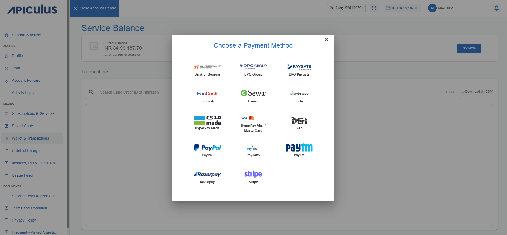
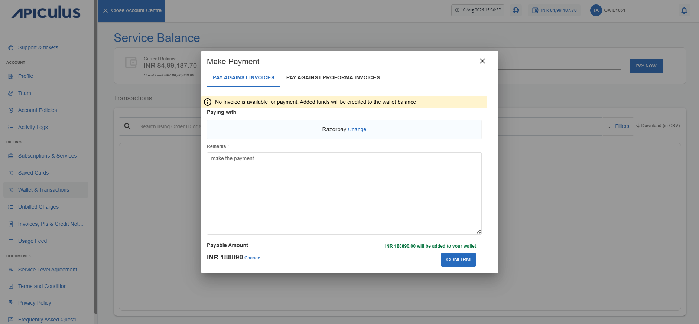

# Wallet and Transactions
This section lists the steps to make payments against Invoices and Proforma Invoices, along with the option to add funds to your wallet.

You can also view the service balance, which is an aggregation of your credit limit, total payments made, and the total charges incurred on your account. The service balance acts as your wallet balance or purchase capacity at any given point in time. Your service balance is always displayed on the top bar and is updated in real time when a transaction or charge is recorded.

To add a payment against your invoice or Proforma invoice, follow these steps:

1. Navigate to **Billing > Wallet & Transactions**.	
2. Enter the amount to pay and click the **Pay Now** button. The following screen appears:
3. Select the preferred payment method.
4. Select one of the following tabs:
    - **Pay Against Invoice**: Enter the Remarks and amount you want to distribute among the Invoices.
    - **Pay Against Proforma Invoice**: Enter the Remarks and amount you want to distribute among the Proforma Invoices. The remaining amount will be added to the wallet.
:::note 
If there are multiple PIs, you can distribute the amount among them or add the entire amount
directly to the wallet.  
:::
5. Click the **Confirm** button. A confirmation window appears: 
6. Click **Confirm**.

You will be redirected to the payment gateway screen.