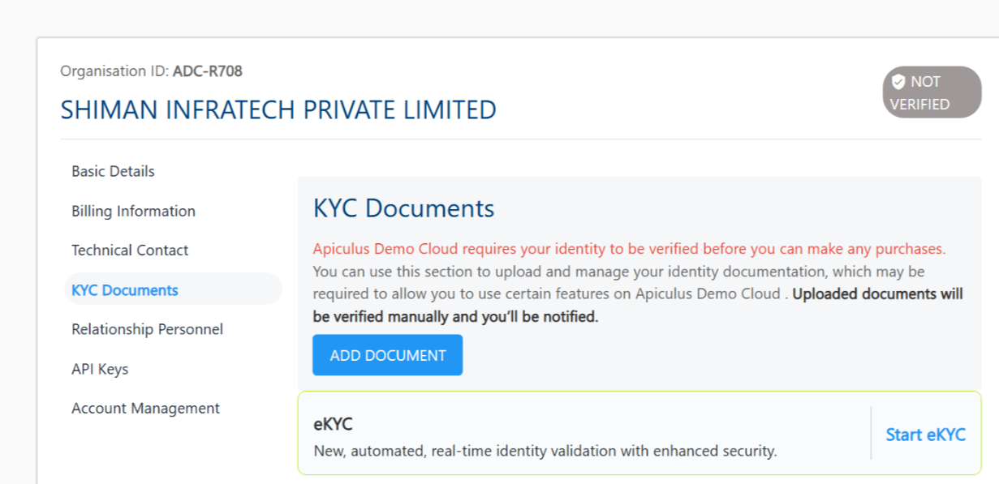
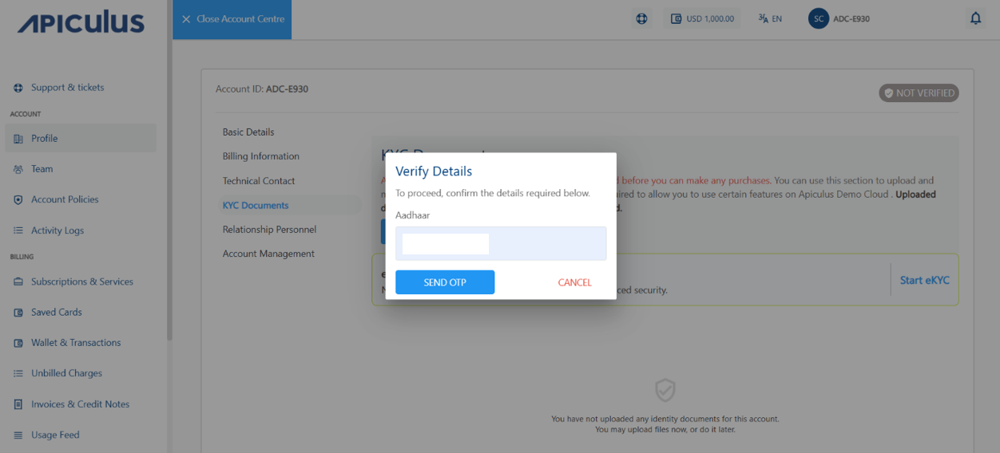
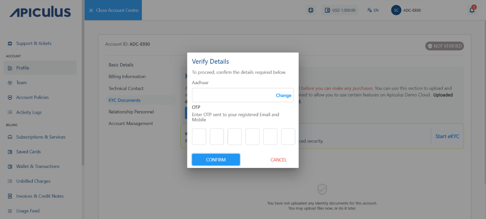
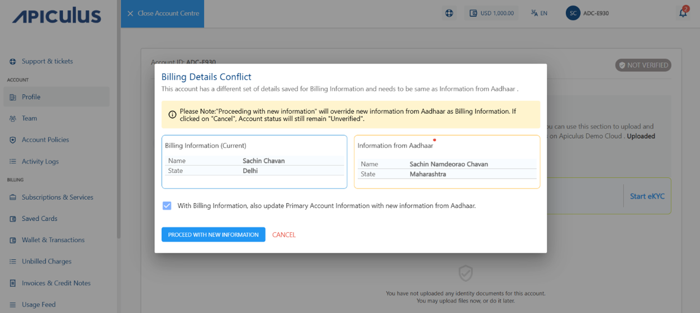
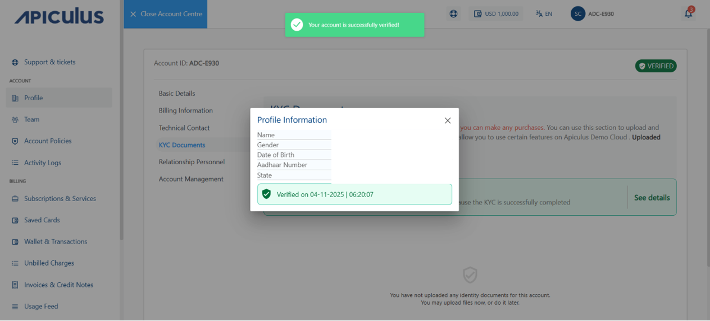
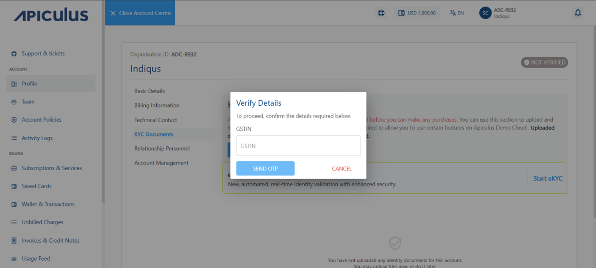
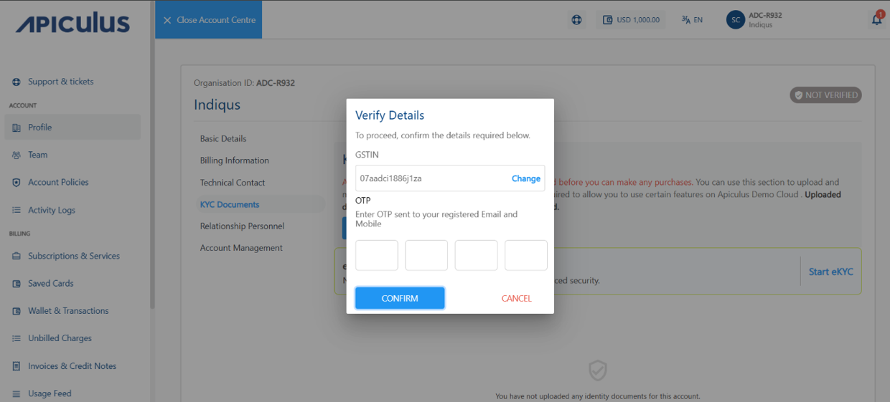
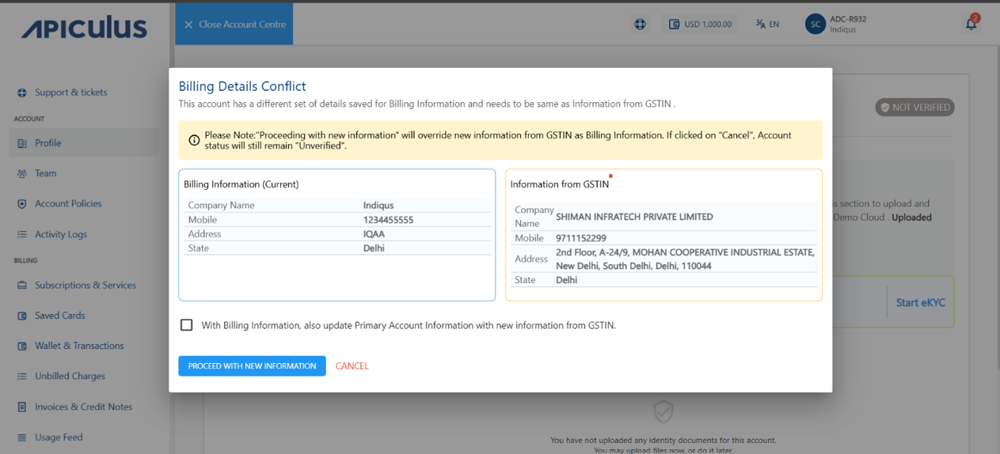

# eKYC

eKYC enables you to complete your verification quickly and easily. It automates the KYC process by using Aadhar number and GSTIN.

To start your eKYC, follow these steps:

1.  Navigate to **Account Centre > KYC Documents**. The following screen appears:
	
2. Click **Start eKYC.** 
	- **For individual account** -
		1. Enter your Aadhar number. Click **Send OTP**.
			
		2. Enter the **OTP** your received on your registered mobile number and email ID.
		3. Click **Confirm**.
			
			The following pop-up appears:
			
		4. If you want to update the account information, select the **With Billing Information, also Update Primary Account Information with new Information from Aadhar** option.
		5.  Click **proceed with new information**.
				
	- **For organisation account**-
		1. Enter your GSTIN number. Click **Send OTP**.
			
		2. Enter the **OTP** your received on your registered mobile number and email ID.
		3. Click **Confirm**.
			
		 The following pop-up appears:
			
		4. If you want to update the account information, select the **With Billing Information, also Update Primary Account Information with new Information from GSTIN** option.
		5. Click **proceed with new information**.
			