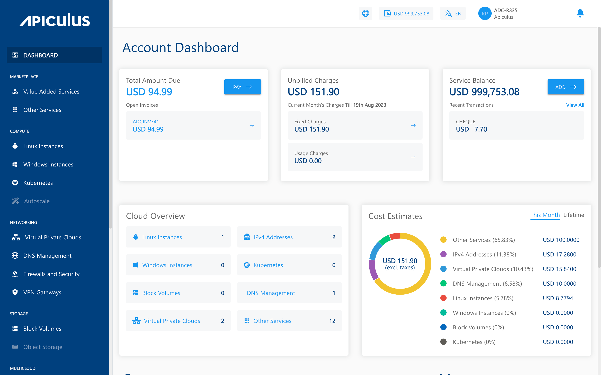

# Cloud/Operations Management
Setting up and managing cloud resources on [Apiculus Cloud Console](CloudConsoleOverview) follows a highly intuitive approach that is built on the UX principles of modern-day software. The Cloud Console user journeys are simple, visual, and information-rich which makes managing cloud resources extremely satisfying.

The general guidelines to follow when using the Apiculus Cloud Console to manage cloud resources:

- The Cloud Console dashboard is always accessible in one click (by clicking on **Dashboard** while in the cloud management view, or by 'closing' the [Account Centre](/docs/Subscribers/AccountCentre/AboutApiculusAccountCentre) view). This ensures that it's always easy to restart an experience.
  
- The experience is split into 2 clear divisions (**cloud resource management** and **account management**). This ensures complete focus and a very low cognitive load as part of the user experience.
- The main navigation bar lists all available services, allowing users to access them with a single click from any section in the **cloud management view**. This ensures easy access and seamless navigation, making it simple to restart any sub-experience. The **Account Centre** follows the same approach, enabling users to reach all available sections with a single click.
- **Resource/Service management** follows the same UX pattern everywhere and all purchased/provisioned resources can be accessed in the same way, regardless of the Service. This design ensures consistency and predictability in the user experience.
- Custom links that include external knowledge bases, videos, media, and other rich information on **how to use Apiculus** are always available in the **cloud management view**. Similarly, commercial information (such as privacy policy, SLA, EULA, etc.) is always available in the **Account Centre view**. This design ensures that information is strategically provided on the Cloud Console interface.

:::note
Detailed guides on cloud resource management can be found in the following sections.
:::

