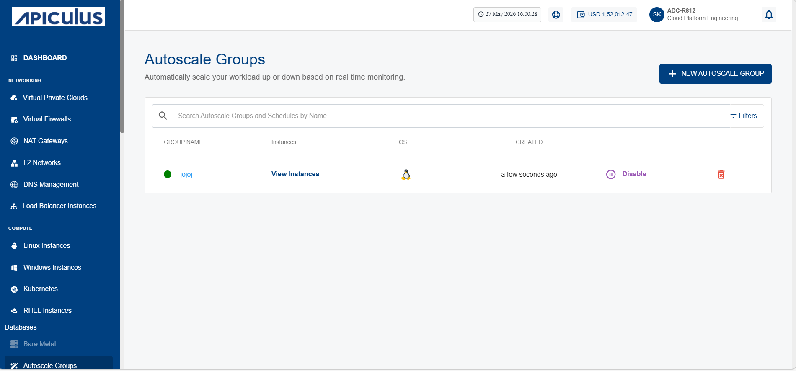
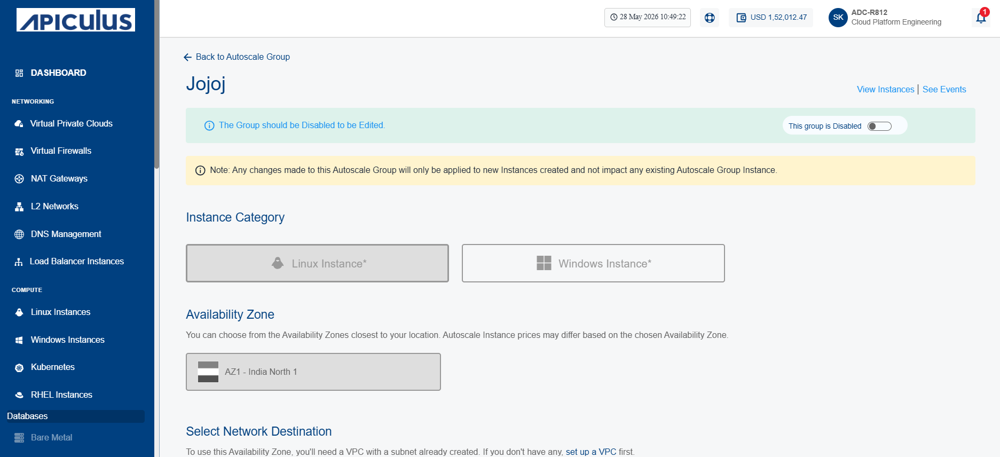

# Editing Autoscale Group
To edit an Autoscale group, you must first disable it.

The following are the editable fields:
- OS Image (must belong to the same Zone)
- Disk Size (≥ template minimum)
- Compute Offering (CPU/RAM)

The following are the cases when you upload your own image and create an Autoscale group or update an Autoscale group.
- If the image has fixed root disk size, use default.
- If the image allows override, show the field and pre-filled with minimum size.
- If the image has no disk size, force user to select disk offering or enter custom size.

:::note 
- Disk Size: Cannot go below the template minimum value.
- Polling Interval: ≥ 60s.
- Quiet Time: ≥ 2m.
- OS Image: Must belong to the same Availability Zone.
- Service Offering: Must be available for autoscale.
- Rollback: If an update fails, the old configuration stays intact.
:::

To edit an autoscale group, follow these steps:
1. Navigate to **Databases** > **Autoscale groups** in the navigation menu. The following screen appears:
	
2. If the Autoscale group is enabled (Shows as **Disable**), click on **Disable** to disable it. 
3. Click on the group name in the GROUP NAME column. The following screen appears: 
4. Make the desired changes and scroll down to the bottom of the screen.
5. Click **Update and Enable This Group**. The following screen appears:  
6. Click **Confirm & Update**.