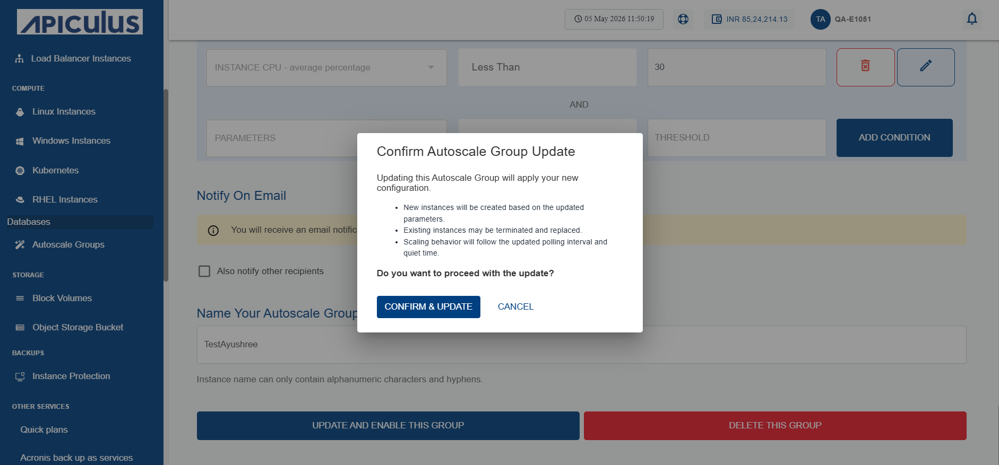

# Editing Autoscale Group

After an Autoscale group is created, you can edit the Autoscale Group settings. 

The following are the editable fields:
- OS Image (must belong to the same Zone)
- Disk Size (≥ template minimum)
- Compute Offering (CPU/RAM)

The following are the cases when you upload your own image and create an Autoscale group or update an Autoscale group.
- If the image has fixed root disk size, use default.
- If the image allows override, show the field and pre-filled with minimum size.
- If the image has no disk size, force user to select disk offering or enter custom size.

After updating the changes, click **Update Autoscale Group**. The following screen appears:

- Click **Confirm & Update**.
### Validations 
- Disk Size: Cannot go below the template minimum value.
- Polling Interval: ≥ 60s.
- Quiet Time: ≥ 2m.
- OS Image: Must belong to the same Availability Zone.
- Service Offering: Must be available for autoscale.
- Rollback: If an update fails, the old configuration stays intact.