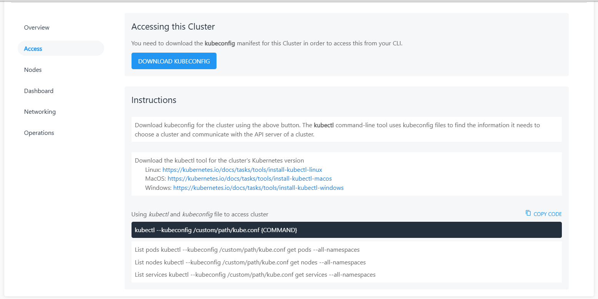
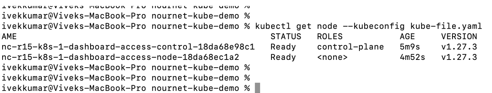
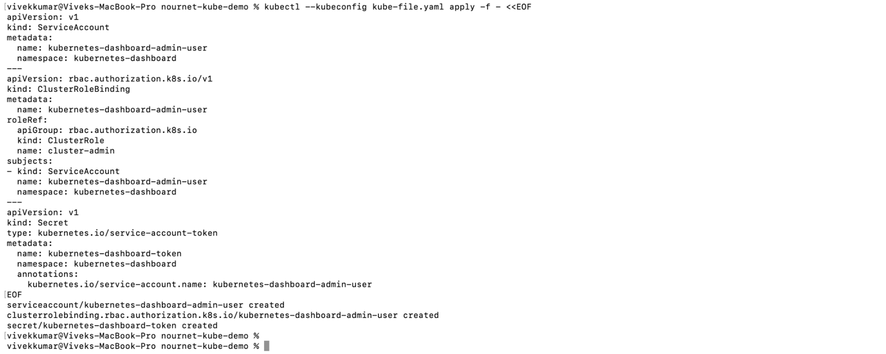
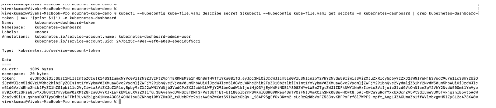
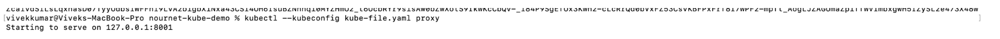
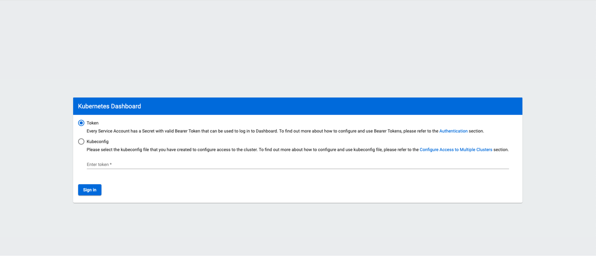
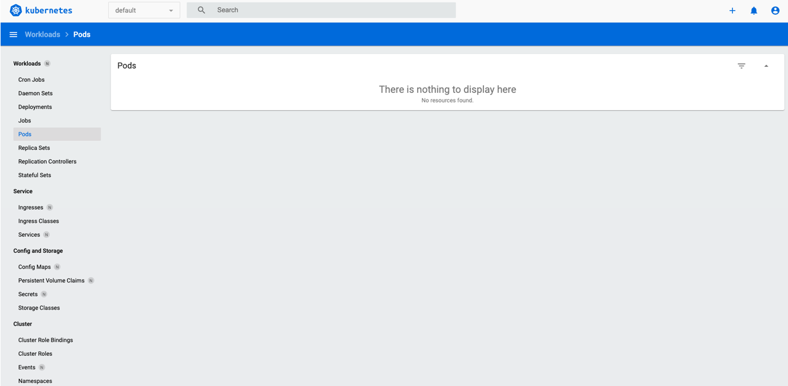

# Accessing the Kubernetes Dashboard

To access the dashboard in Kubernetes version 1.24 and onwards, follow these steps:

1. Create a Kubernetes cluster.
2. Navigate to the **Kubernetes Clusters** screen, select your Kubernetes cluster, and go to the **Access** section. Download the `kubeconfig` file from there.
	 
	 :::note
	Ensure that `kubectl` is installed on your system or any system from which you are trying to access the Kubernetes API.
	 :::
3. Verify access by running the following commands: <br/>
	`# kubectl get node --kubeconfig kube-file.yaml`<br/>
	`# kubectl get pods --kubeconfig kube-file.yaml`<br/>
	`# kubectl get services --kubeconfig kube-file.yaml`<br/><br/>
	You should be able to see the following output:<br/><br/>
	
4.  Create a service account and a secret token to access the dashboard.
	- **For Windows**: Create a YAML file using the following code. 
	```
	apiVersion: v1
	kind: ServiceAccount
	metadata:
	  name: kubernetes-dashboard-admin-user
	  namespace: kubernetes-dashboard
	---
	apiVersion: rbac.authorization.k8s.io/v1
	kind: ClusterRoleBinding
	metadata:
	  name: kubernetes-dashboard-admin-user
	roleRef:
	  apiGroup: rbac.authorization.k8s.io
	  kind: ClusterRole
	  name: cluster-admin
	subjects:
	- kind: ServiceAccount
	  name: kubernetes-dashboard-admin-user
	  namespace: kubernetes-dashboard
	---
	apiVersion: v1
	kind: Secret
	type: kubernetes.io/service-account-token
	metadata:
	  name: kubernetes-dashboard-token
	  namespace: kubernetes-dashboard
	  annotations:
	    kubernetes.io/service-account.name: kubernetes-dashboard-admin-user
	```
	- Run the following command:<br/>
		 `#kubectl --kubeconfig /custom/path/kube.conf apply -f file.yaml`

	- **For Linux**: Copy the following code on the CLI:<br/>
	```
	kubectl --kubeconfig /custom/path/kube.conf apply -f - <<EOF
	apiVersion: v1
	kind: ServiceAccount
	metadata:
	  name: kubernetes-dashboard-admin-user
	  namespace: kubernetes-dashboard
	---
	apiVersion: rbac.authorization.k8s.io/v1
	kind: ClusterRoleBinding
	metadata:
	  name: kubernetes-dashboard-admin-user
	roleRef:
	  apiGroup: rbac.authorization.k8s.io
	  kind: ClusterRole
	  name: cluster-admin
	subjects:
	- kind: ServiceAccount
	  name: kubernetes-dashboard-admin-user
	  namespace: kubernetes-dashboard
	---
	apiVersion: v1
	kind: Secret
	type: kubernetes.io/service-account-token
	metadata:
	  name: kubernetes-dashboard-token
	  namespace: kubernetes-dashboard
	  annotations:
	    kubernetes.io/service-account.name: kubernetes-dashboard-admin-user
	EOF
	```

	You should be able to see the following output:<br/><br/>
	

 5. Fetch the secret token for dashboard login using the following command:
	:::note
	Windows users must run the command in PowerShell.
	:::
	
	```
	# kubectl --kubeconfig /custom/path/kube.conf describe secret $(kubectl -- kubeconfig /custom/path/kube.conf get secrets -n kubernetes-dashboard | grep kubernetes-dashboard-token | awk '{print $1}') -n kubernetes-dashboard
	```
	You can see the token in the output that follows.
			
	    
5. Run the following command to start the proxy for the Kubernetes cluster: <br/>
	`# kubectl --kubeconfig /custom/path/kube.conf proxy`
	You should be able to see the following output:<br/><br/>
	
7. Open the following URL on your browser:
	[http://localhost:8001/api/v1/namespaces/kubernetes-dashboard/services/https:kubernetes-dashboard:/proxy/](http://localhost:8001/api/v1/namespaces/kubernetes-dashboard/services/https:kubernetes-dashboard:/proxy/)

To view the dashboard interface, click **Token**, paste the token fetched from **Step 5**, and click **Sign in**.


