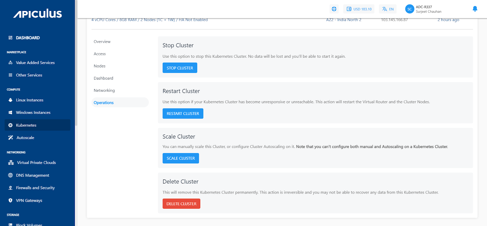
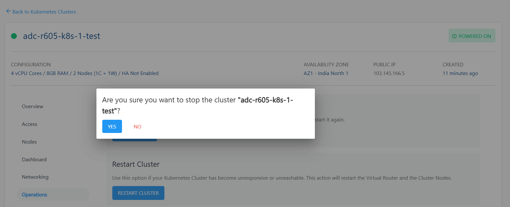
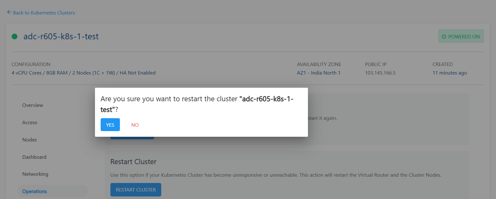
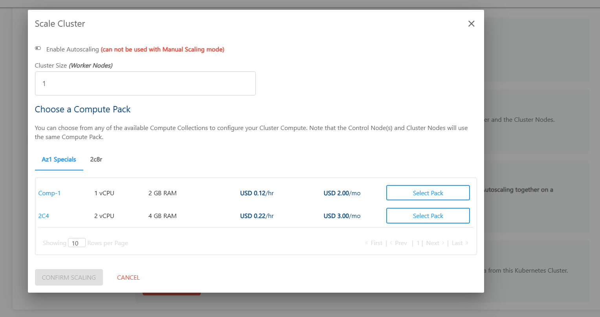
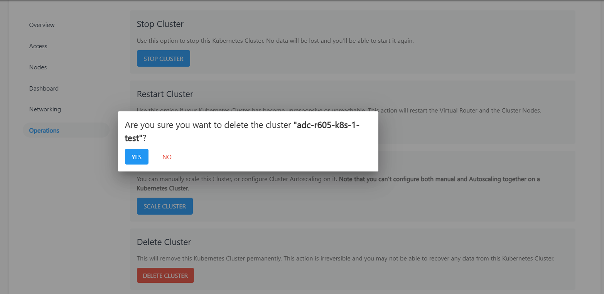

# Cluster Operations

Kubernetes clusters created on Apiculus Cloud Console allow for a set of management operations from the Cloud Console UI. While these options can be controlled using `kubectl`, these are provided on the UI for quick and easy access.

## Powering ON/OFF a Cluster

Kubernetes clusters can be powered ON/OFF using the **power** button on top of the cluster details. This button will typically show in **green** when a cluster is powered ON, and grey when powered OFF.

## Stopping and Restarting a Cluster

Kubernetes clusters can be stopped or restarted from the **Operations** section of cluster details.

- **Stop Cluster** - To stop the Kubernetes cluster. No data will be lost, and the cluster can be started again.
	
- **Restart Cluster** - This action restarts the Virtual Router and the cluster nodes can/should be used if a Kubernetes Cluster has become unresponsive or unreachable.
	

- **Scaling Cluster** - This action is to manually scale this Cluster, or configure Cluster Autoscaling on it. 
	:::note
	that you can’t configure both manual and Autoscaling together on a Kubernetes Cluster.
	:::
	

## Deleting a Cluster

To delete a cluster permanently, navigate to **cluster details**, select a **Operations** section and click the **DELETE CLUSTER** option.

:::note
This action is irreversible, and no data from a deleted Kubernetes cluster can be recovered.
:::

