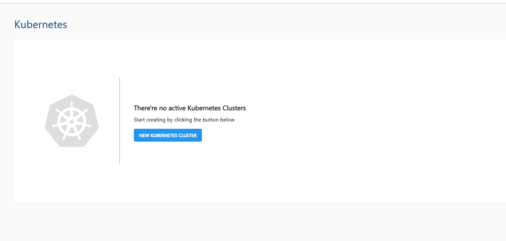
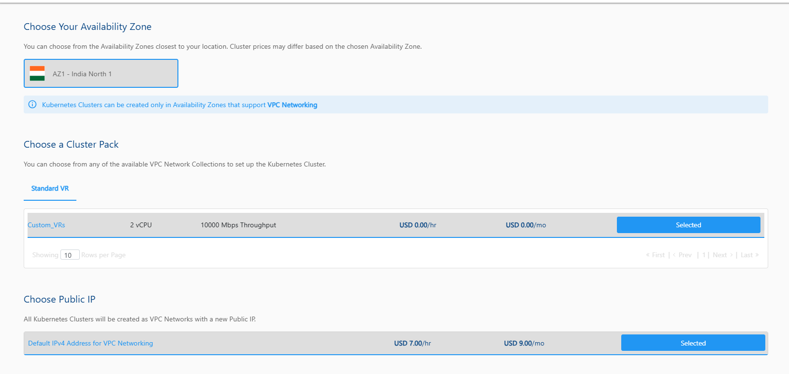
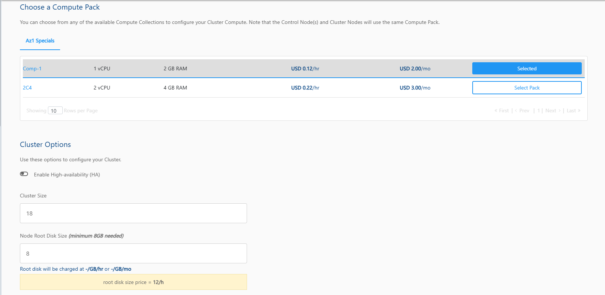
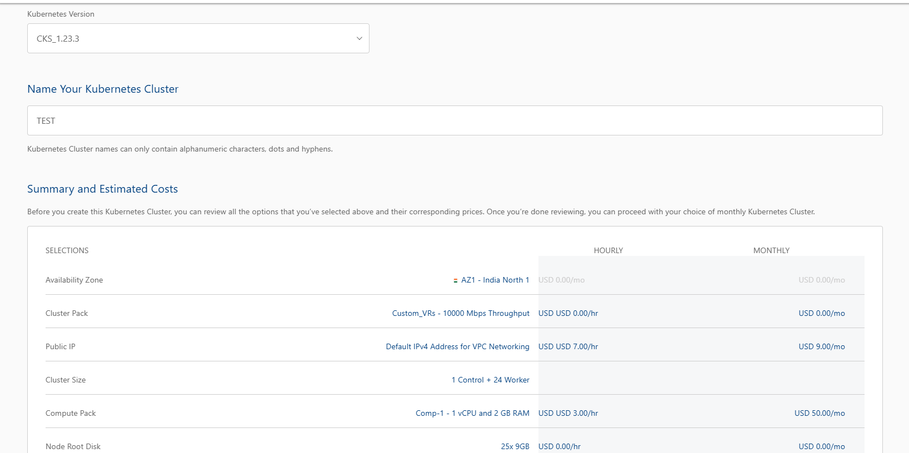

# Creating a Kubernetes Cluster

To create a Kubernetes cluster on an advanced VPC AZ, follow the below steps:

1. Navigate to **Compute > Kubernetes** 
2. Click on the **+ NEW KUBERNETES CLUSTER** button.
   
3. Choose an Availability Zone, which is the geographical region where your Kubernetes cluster will be deployed. Kubernetes Clusters can be created only in Availability Zones that support VPC Networking.
4. Select a cluster pack from any of the available VPC Network Collections.
5. Public IP will be selected by default.
    
6. Select a compute pack from the available compute collections.
7. You need to define the various cluster options listed below:
    1. You can enable the high availability HA for the cluster.
    2. Specify the cluster size, i.e., the no. of worker nodes (Maximum Cluster Size doesn't exceed 20 nodes).
    3. Specify the node root disk size; a minimum of 8GB is required 
    4. Select the Kubernetes version
   
8. Verify the Estimated Cost of your Kubernetes Cluster based on the chosen specifications(Here, both the Hourly and Monthly Prices summary are displayed)
   
9. After going through the policies your cloud service provider mentioned, select the **I have read and agreed to the End User License Agreement and Privacy Policy** option.
10. Choose the BUY HOURLY or BUY MONTHLY option. A confirmation window appears and the price summary will be displayed along with the discount codes if you have any in your account. 
    - You can apply any of the discount codes listed by clicking on the **APPLY** button. 
    - You can also remove the applied discount code by clicking on the **REMOVE** button. 
    - You can cancel this action by clicking on the **CANCEL** button.
11. Click **CONFIRM** to create the Windows Instance.

:::note
This might take up to 5-8 minutes. You may use the Cloud Console during this time, but it is advised that you do not refresh the browser window.
:::

Once ready, you get notified of this purchase on your email address on record. To access the  newly created Windows Instances, navigate to **Compute >** **Kubernetes** on the main navigation panel.

