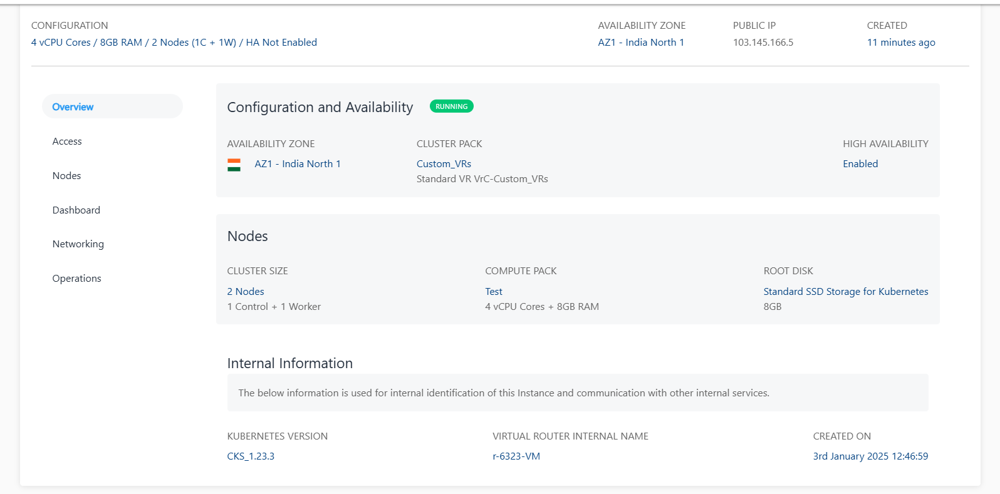

# Overview

To view the below details, navigate to [Kubernetes](AboutKubernetes.md), select a Kubernetes Cluster, and access the **Overview** tab.

- [Configuration and Availability](#configuration-and-availability)
- [Nodes](#nodes-information)
- [Internal Information](#internal-information)

## Configuration and Availability

1. The cluster’s status, **RUNNING**, is displayed in Green, whereas **STOPPED** is displayed in grey.
2. Information about the VPC networking zone

## Nodes Information 

This displays the basic information about the nodes as listed below:

- Cluster Size
- Computed Pack
- Root disk size

## Internal Information

This displays the information used for internal identification of this Cluster and communication with other internal services.

- Kubernetes Version
- Virtual router internal name
- Created on

