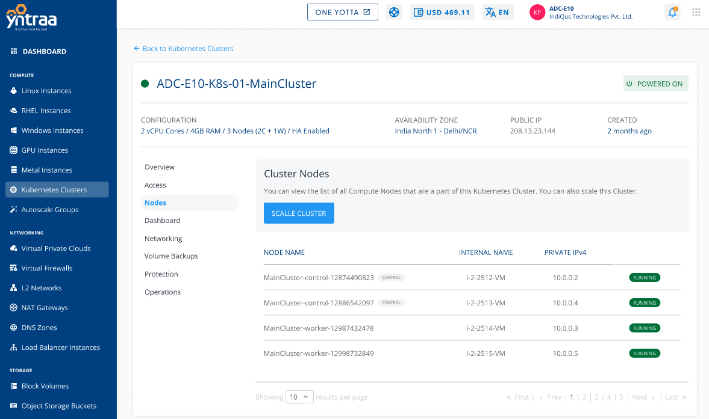
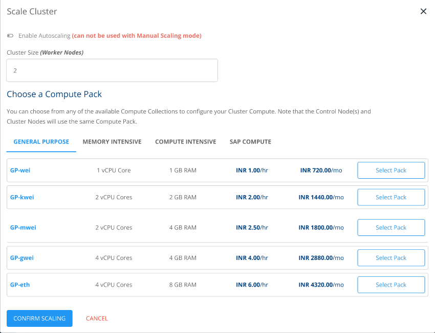
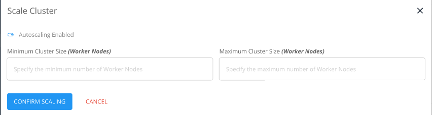

# Scaling Kubernetes Clusters

Apiculus cloud console allows for manual and automatic cluster scaling. Clusters scaling can be configured from the **Nodes** section of cluster details or from the **Operations** section of cluster details.
## Manually Scaling a Cluster

1. Navigate to **Operations** > **Nodes**, click the **SCALE CLUSTER** button. A window appears, keep **autoscaling** disabled.
2. Select one of the available compute packs.
3. Click **CONFIRM SCALING**.

## Automatically Scaling a Cluster

1. Navigate to **Operations** > **Nodes**, click the **SCALE CLUSTER** button. A Window appears, enable **autoscaling**.
2. Enter the minimum and maximum number of worker nodes.
3. Click **CONFIRM SCALING**.

:::note
If the **Scale** operation fails, stop the cluster and retry the process.
:::
